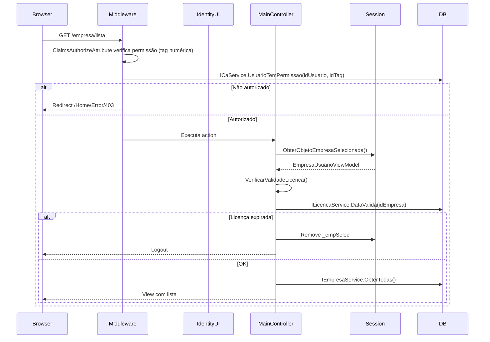
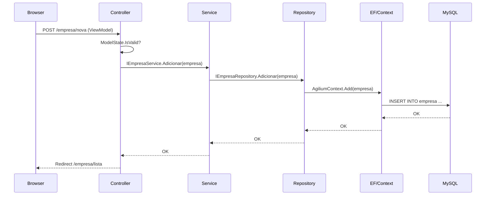
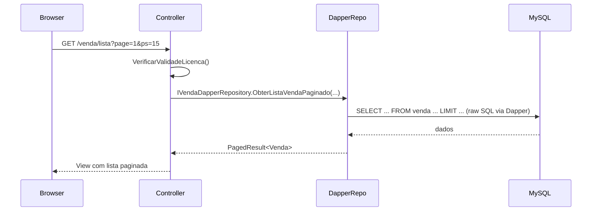
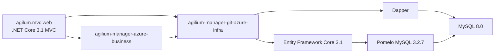
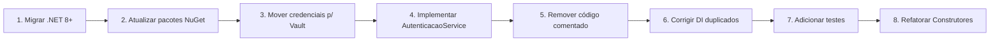

# 📊 Relatório de Análise Arquitetural — Agilium Manager

**Data:** 24/06/2026  
**Analista:** Arquitetura de Software  
**Versão do sistema:** 1.0.0  
**Versão do BD:** 8.0.19  

---

## 1. Resumo Executivo

O **Agilium Manager** é um sistema ERP (Enterprise Resource Planning) web direcionado ao mercado brasileiro, construído em **.NET Core 3.1 MVC**, com **MySQL 8** como banco de dados, utilizando **Entity Framework Core** e **Dapper** para acesso a dados. A aplicação gerencia múltiplas empresas, oferecendo funcionalidades de controle financeiro, vendas, compras, estoque, inventário, emissão fiscal (NFC-e/NFe), PDV, controle de acesso e licenciamento. O front-end é baseado em **AdminLTE** (Bootstrap) com Razor Views. A aplicação está conteinerizada via **Docker** com suporte a **ARM**.

---

## 2. Objetivo do Sistema

**Problema de negócio resolvido:** Gestão completa de operações comerciais para empresas brasileiras de pequeno e médio porte.

### Módulos Principais

| Módulo | Propósito |
|--------|-----------|
| **Empresa** | Cadastro multi-empresa, configurações fiscais |
| **Produto/Estoque** | Cadastro de produtos, controle de estoque, código de barras (EAN-13), QR Code |
| **Venda (PDV)** | Ponto de venda, emissão de NFC-e/NFe, múltiplas formas de pagamento |
| **Compra** | Importação de NFe (XML), entrada de mercadorias |
| **Financeiro** | Contas a pagar/receber, plano de contas, categorias financeiras, caixa |
| **Fiscal** | Tabelas auxiliares (CFOP, CST, CSOSN, CEST, NCM, IBPT) |
| **Cliente/Fornecedor** | Cadastro de clientes PF/PJ e fornecedores |
| **Funcionário** | Gestão de funcionários e entregadores |
| **Inventário** | Controle e contagem de inventário |
| **Turno** | Controle de turnos operacionais |
| **Controle de Acesso** | Usuários, perfis, permissões granulares por tags numéricas |
| **Licenciamento** | Validação de licença por empresa |

---

## 3. Arquitetura Identificada

### 3.1 Tecnologias Utilizadas

| Camada | Tecnologia | Versão |
|--------|-----------|--------|
| **Runtime** | .NET Core | 3.1 (⚠️ EOL desde dez/2022) |
| **Framework Web** | ASP.NET Core MVC | 3.1 |
| **ORM Principal** | Entity Framework Core | 3.1.32 |
| **ORM Secundário** | Dapper | — |
| **Banco de Dados** | MySQL (Pomelo) | 8.0 / Pomelo 3.2.7 |
| **Autenticação** | ASP.NET Core Identity | 3.1.32 |
| **Mapeamento** | AutoMapper | 8.1.1 |
| **Front-end** | AdminLTE + Bootstrap + jQuery | — |
| **Criptografia** | BouncyCastle (Blowfish) | 1.8.9 |
| **Código de Barras** | ZXing.Net + QRCoder | 0.16.11 / 1.4.3 |
| **Imagens** | SixLabors.ImageSharp | 2.1.7 |
| **Resiliência** | Microsoft.Extensions.Http.Polly | 6.0.36 |
| **Containerização** | Docker | — |

### 3.2 Padrão Arquitetural

**Padrão: MVC com camadas separadas (Clean Architecture-like)**

```
┌─────────────────────────────────────────────────────┐
│  Camada de Apresentação (agilum.mvc.web)            │
│  ┌───────────┐  ┌──────────┐  ┌──────────────────┐ │
│  │  Views    │  │Controllers│  │   ViewModels     │ │
│  │ .cshtml   │◄─┤ (24)     │──►  (+40)           │ │
│  │ AdminLTE  │  └──────────┘  └──────────────────┘ │
│  └───────────┘         │                            │
├────────────────────────┼────────────────────────────┤
│  Camada de Negócio     │                            │
│  (agilium-manager-azure-business)                   │
│  ┌──────────┐  ┌──────┐  ┌───────┐  ┌───────────┐ │
│  │ Services │  │Models│  │ Enums │  │Validations│ │
│  │ (+20)    │  │      │  │       │  │           │ │
│  └──────────┘  └──────┘  └───────┘  └───────────┘ │
├────────────────────────┼────────────────────────────┤
│  Camada de Infra       │                            │
│  (agilium-manager-git-azure-infra)                  │
│  ┌──────────┐  ┌──────────┐  ┌──────────────────┐  │
│  │Repository│  │ Context  │  │  Dapper Queries  │  │
│  │ (EF Core)│  │          │  │                  │  │
│  └──────────┘  └──────────┘  └──────────────────┘  │
├────────────────────────┼────────────────────────────┤
│                    MySQL 8.0                         │
│                 (agiliumadm)                         │
└─────────────────────────────────────────────────────┘
```

> ⚠️ **Violação de DIP:** O projeto web referencia diretamente a camada de infraestrutura, e Controllers importam namespaces de Repository.

### 3.3 Diagrama de Rotas e Endpoints

```
/                          → HomeController.Index()
/licenca                   → HomeController.Licenca()
/ObterVersaoSistema        → HomeController.ObterVersaoSistema() [AllowAnonymous]
/sistema-indisponivel      → HomeController.SistemaIndisponivel() [AllowAnonymous]

/empresa/lista             → EmpresaController.Index()
/empresa/nova              → EmpresaController.Create() [GET/POST]

/usuario/lista             → UsuarioController.Index()
/usuario/criar-novo-usuario → UsuarioController.CreateNovoUsuarioWeb()

/produto/lista             → ProdutoController.Index()

/estoque/lista             → EstoqueController.Index()
/estoque/estoque/novo      → EstoqueController.CreateEstoque()

/venda/lista               → VendaController.Index()
/venda/detalhes            → VendaController.VendaDetalhe()

/compra/lista              → CompraController.Index()

/caixa/lista               → CaixaController.IndexCaixa()
/caixa/movimentacao        → CaixaController.IndexMovimentacao()

/cliente/lista             → ClienteController.Index()
/cliente/novo              → ClienteController.CreateCliente()

/fornecedor/lista          → FornecedorController.Index()
/fornecedor/novo           → FornecedorController.CreateFornecedor()

/pdv/lista                 → PontoVendaController.Index()
/pdv/novo                  → PontoVendaController.Create()

/conta/lista               → ContaController (Contas a Pagar/Receber)
/plano-conta/lista         → PlanoContaController
/turno/lista               → TurnoController.Index()
/moeda/lista               → MoedaController
/inventario/lista          → InventarioController.Index()
/perda/lista               → PerdaController
/devolucao/lista           → DevolucaoController
/funcionario/lista         → FuncionarioController
/config/lista              → ConfigController.Index()
/licenca/Index             → LicencaController.Index()
/log/lista                 → LogController
/vale/lista                → ValeController
/unidade/lista             → UnidadeController
/endereco/lista            → EnderecoController
/categoria-financeira/lista → CategoriaFinanceiraController
/forma-pagamento/lista     → FormaPagamentoController
```

---

## 4. Fluxo Principal da Aplicação

### 4.1 Fluxo de Autenticação e Autorização



### 4.2 Fluxo de CRUD (ex: Empresa)



### 4.3 Fluxo de Consulta com Dapper (Vendas)



---

## 5. Dependências Críticas

### 5.1 Diagrama de Dependências entre Projetos



### 5.2 Principais Interfaces e Implementações

| Interface | Implementação | Projeto |
|-----------|--------------|---------|
| `IUser` | `AspNetUser` | web |
| `INotificador` | `Notificador` | business |
| `IAutenticacaoService` | `AutenticacaoService` ⚠️ | web |
| `IEmailSender` | `ServiceEmail` | web |
| `IEmpresaService` | `EmpresaService` | business |
| `IEmpresaRepository` | `EmpresaRepository` | infra |
| `IProdutoService` | `ProdutoService` | business |
| `IVendaService` | `VendaService` | business |
| `ILicencaService` | `LicencaService` | business |
| `ICaService` | `CaService` | business |
| `ILogService` | `LogService` | business |
| `IConfigService` | `ConfigService` | business |
| `IDapperRepository` | `DapperRepository` | infra |

---

## 6. Regras de Negócio Encontradas

1. **Multi-empresa:** O sistema suporta múltiplas empresas. O usuário seleciona uma empresa ativa armazenada na sessão HTTP (`_empSelec`).

2. **Validação de licença:** Toda ação em controller que envolve empresa verifica se a licença está dentro da data de validade (`ILicencaService.DataValida`). Licença expirada força logout.

3. **Controle de acesso granular:** Permissões são baseadas em tags numéricas (ex: `[ClaimsAuthorizeAttribute(2001)]`). Cada ação tem uma tag única:
   - `1000-1999` → Usuários e Controle de Acesso
   - `2000-2099` → Empresas e Clientes
   - `2050-2099` → Estoque
   - `2100-2199` → Inventário, PDV, Turno, Caixa, Venda

4. **Geração de códigos:** Códigos de produtos, empresas, clientes e fornecedores são gerados automaticamente com sequence numbers do banco.

5. **Código de barras EAN-13 e QR Code:** Produtos podem ter código de barras gerado (ZXing) e QR Code (QRCoder).

6. **Importação de NFe (XML):** O sistema lê e processa XML de Nota Fiscal Eletrônica para entrada de compras, usando `XmlSerializer`.

7. **Localização pt-BR:** Cultura brasileira configurada com formato de data `dd/MM/yyyy`, separador decimal `,` e separador de milhar `.`.

8. **Criptografia de senhas/configurações:** Usa `PassCrypto` (baseado em componente Delphi legado) com Blowfish64 + métodos customizados (XChange, DES64, HEX, XOR).

9. **Paginação padrão:** 15 itens por página (`ObterQuantidadeLinhasPorPaginas()`).

10. **Controle de sessão:** Sessão HTTP com timeout de 3 horas, cookies HttpOnly e IsEssential.

---

## 7. Riscos Técnicos

### 🔴 Críticos

| Risco | Detalhe | Localização |
|-------|---------|-------------|
| **.NET Core 3.1 EOL** | Fora de suporte desde dez/2022. Sem patches de segurança. | `agilum.mvc.web.csproj:3` |
| **Credenciais hardcoded** | Senha do MySQL e email em texto plano nos appsettings. | `appsettings.json:10-12` e `:17-21` |
| **AutenticacaoService não implementado** | Todos os métodos lançam `NotImplementedException`. | `Services/AutenticacaoService.cs:15-24` |
| **Pacotes desatualizados** | Pomelo 3.2.7, AutoMapper 8.1.1, BouncyCastle 1.8.9 — todos com vulnerabilidades conhecidas. | `.csproj` |
| **Dependência circular** | `LicencaController` injeta `ILicencaService licenca` e `ILicencaService licencaService` (parâmetro duplicado). | `Controllers/LicencaController.cs:15` |

### 🟠 Altos

| Risco | Detalhe | Localização |
|-------|---------|-------------|
| **Acoplamento Controller→Repository** | Vários Controllers importam namespaces de Repository (viola DIP). | `UsuarioController.cs:10`, `ProdutoController.cs:5` |
| **Construtor com MUITOS parâmetros** | `CompraController`: 16 parâmetros. `ProdutoController`: 17 parâmetros. | `Controllers/CompraController.cs:68-72` |
| **Dapper duplicado no DI** | `ICaRepositoryDapper` registrado 2x. `IPlanoConta*` registrado 2x. | `Configuration/ResolveDependencyConfig.cs:69,85,240-245` |
| **Conexão MySQL remota exposta** | Connection string aponta para servidor público. | `appsettings.json:9` |
| **Senha temporária hardcoded** | `"Agilium_123"` como senha padrão para novos usuários web. | `Controllers/UsuarioController.cs:93` |

### 🟡 Médios

| Risco | Detalhe | Localização |
|-------|---------|-------------|
| **Nomenclatura inconsistente** | Mistura de inglês e português. Namespace `agilum` vs `agilium`. | Diversos arquivos |
| **Exceção genérica no middleware** | `catch (Exception ex)` redireciona tudo como circuit breaker, mascara erros reais. | `Extensions/ExceptionMiddleware.cs:44-47` |
| **Código comentado extenso** | Grande quantidade de código comentado não removido. | `Controllers/HomeController.cs:47-56`, `Services/ServiceEmail.cs:71-86` |
| **Múltiplos mapeamentos manuais (Reflection)** | `ConverterClasse` — alternativa frágil ao AutoMapper. | `Configuration/ConverterClasse.cs` |
| **Sessão como estado global** | Empresa selecionada em sessão, verificada manualmente em cada action. | `Controllers/MainController.cs:140` |

### 🟢 Baixos

| Risco | Detalhe |
|-------|---------|
| **Estado brasileiro duplicado** | "RS" aparece 2x na lista. "Paraíba" está com sigla "RS" em vez de "PB". |
| **Erro de digitação** | `Crtl` ao invés de `Ctrl` nas teclas de atalho. |
| **Propriedades privadas órfãs** | `MainController` tem campos privados `notificador`, `configuration`, `utilDapperRepository`, `logService`, `mapper` nunca usados (shadowing dos `protected readonly`). |

---

## 8. Mapa de Permissões (Tags Numéricas)

| Tag | Módulo | Ação |
|-----|--------|------|
| 1000 | Usuário | Listar |
| 1002 | Usuário | Criar usuário web |
| 1015 | Config | Listar/Editar |
| 2001 | Empresa | Listar |
| 2002 | Empresa | Criar |
| 2019 | Cliente | Listar |
| 2020 | Cliente | Criar |
| 2025 | Fornecedor | Listar |
| 2026 | Fornecedor | Criar |
| 2050 | Estoque | Listar |
| 2051 | Estoque | Criar |
| 2107 | Inventário | Listar |
| 2120 | PDV | Listar |
| 2121 | PDV | Criar |
| 2134 | Turno | Listar |
| 2156 | Caixa | Listar/Movimentação |
| 2159 | Venda | Listar/Detalhes |

---

## 9. Estrutura de Diretórios (agilum.mvc.web)

```
agilum.mvc.web/
├── Program.cs                    # Entry point
├── Startup.cs                    # Configuração do pipeline
├── appsettings.json              # Configurações (⚠️ credenciais expostas)
├── agilum.mvc.web.csproj         # .NET Core 3.1
├── ScaffoldingReadMe.txt
│
├── Areas/Identity/               # Autenticação (ASP.NET Identity UI)
│
├── Configuration/                # Configurações centralizadas
│   ├── AutomapperConfig.cs       # Mapeamentos AutoMapper
│   ├── ConverterClasse.cs        # Mapeamento manual via Reflection
│   ├── GlobalizationConfig.cs    # Localização pt-BR
│   ├── IdentityConfig.cs         # Config do Identity
│   ├── MoedaAttribute.cs         # Atributo de formatação
│   ├── MvcConfig.cs              # Config MVC + mensagens pt-BR
│   └── ResolveDependencyConfig.cs # DI (300+ linhas)
│
├── Controllers/ (24 controllers)
│   ├── MainController.cs         # Base abstrata
│   ├── HomeController.cs
│   ├── EmpresaController.cs
│   ├── UsuarioController.cs
│   ├── ProdutoController.cs
│   ├── VendaController.cs
│   ├── CompraController.cs
│   ├── CaixaController.cs
│   ├── ... (demais controllers)
│
├── Data/
│   └── dbIdentityContext.cs      # IdentityDbContext + AppUser
│
├── Enums/
│   └── Enums.cs                  # Enums do sistema
│
├── Extensions/                   # Middleware e extensões
│   ├── AspNetUser.cs             # Claims + IUser
│   ├── CustomAuth.cs             # ClaimsAuthorizeAttribute
│   ├── CustomHttpRequestException.cs
│   ├── ExceptionMiddleware.cs
│   ├── HtmlExtensions.cs         # Enum → SelectList
│   ├── IdentityMensagensPortugues.cs
│   ├── MoedaAttribute.cs
│   ├── PaginacaoViewComponent.cs
│   ├── SummaryViewComponent.cs
│   └── TagHelpers.cs
│
├── Interfaces/
│   ├── IAutenticacaoService.cs   # ⚠️ Não implementado
│   └── IImportarXMLNfe.cs
│
├── Services/
│   ├── AutenticacaoService.cs    # ⚠️ NotImplementedException
│   ├── CodigoProdutoGenerator.cs # EAN-13 + QR Code
│   ├── ListasAuxilares.cs        # Estados, teclas de atalho
│   ├── PassCrypto.cs             # Criptografia legada (Delphi)
│   ├── ServiceEmail.cs           # Envio de emails
│   └── Utils.cs                  # Conversão de arquivos/imagens
│
├── ViewModels/                   # +40 ViewModels
│   ├── PagedResult.cs            # Paginação genérica
│   ├── Estado.cs
│   ├── ErrorViewModel.cs
│   ├── RefreshToken.cs
│   ├── Caixa/
│   ├── Cliente/
│   ├── Compra/
│   ├── Config/
│   ├── Conta/
│   ├── Contato/
│   ├── Devolucao/
│   ├── Empresa/
│   ├── EmpresaUsuario/
│   ├── Endereco/
│   ├── Estoque/
│   ├── FormaPagamento/
│   ├── Fornecedor/
│   ├── Funcionarios/
│   ├── Impostos/
│   ├── Inventario/
│   ├── Licenca/
│   ├── Log/
│   ├── Moedas/
│   ├── Perda/
│   ├── PlanoConta/
│   ├── PontoVenda/
│   ├── Produtos/
│   ├── Turno/
│   ├── UnidadeViewModel/
│   ├── Usuarios/
│   ├── Vale/
│   └── Venda/
│
├── Views/                        # Razor Views (.cshtml)
└── wwwroot/                      # Assets estáticos (AdminLTE, CSS, JS, imagens)
```

---

## 10. Próximos Passos Recomendados



### Por ordem de prioridade:

| # | Ação | Severidade | Esforço |
|---|------|-----------|---------|
| 1 | Remover credenciais hardcoded dos `appsettings.json` (usar Azure Key Vault ou User Secrets) | 🔴 Crítico | Baixo |
| 2 | Planejar migração do .NET Core 3.1 para .NET 8 | 🔴 Crítico | Alto |
| 3 | Corrigir registros duplicados no `ResolveDependencyConfig` | 🟠 Alto | Baixo |
| 4 | Implementar `AutenticacaoService` (atualmente só lança `NotImplementedException`) | 🟠 Alto | Médio |
| 5 | Limpar código comentado e imports não usados | 🟡 Médio | Baixo |
| 6 | Corrigir lista de estados brasileiros (PB com sigla errada como RS) | 🟡 Médio | Baixo |
| 7 | Refatorar construtores com muitos parâmetros (padrão Facade ou MediatR) | 🟢 Baixo | Alto |
| 8 | Adicionar testes automatizados (não há testes no projeto) | 🟢 Baixo | Alto |

---

## 11. Avaliação de Maturidade

| Dimensão | Nota (1-5) | Observação |
|----------|-----------|------------|
| Organização do código | 3 | Estrutura de diretórios clara, mas acoplamento entre camadas |
| Padrões de projeto | 3 | MVC + Repository + DI bem aplicados, mas com violações |
| Segurança | 2 | Credenciais expostas, auth incompleto, .NET EOL |
| Manutenibilidade | 3 | Código repetitivo, construtores inchados, mas previsível |
| Performance | 3 | Dapper para queries pesadas, mas sem cache visível |
| Documentação | 1 | Sem documentação técnica além do ScaffoldingReadMe |
| Testabilidade | 1 | Zero testes automatizados |
| Atualização tecnológica | 1 | .NET Core 3.1 EOL + pacotes com vulnerabilidades |

**Nota geral: 2.1 / 5**

---

## 12. Arquivos Ainda Necessários para Análise Completa

| Arquivo | Motivo |
|---------|--------|
| `agilium-manager-azure-business/Models/*.cs` | Entender modelo de domínio completo e relacionamentos |
| `agilium-manager-azure-business/Services/*.cs` | Entender lógica de negócio real |
| `agilium-manager-azure-business/Enums/` | Mapear enums de negócio completos |
| `agilium-manager-git-azure-infra/Context/AgiliumContext.cs` | Mapeamento EF completo das entidades |
| `agilium-manager-git-azure-infra/Repository/` | Implementações de Repository e queries Dapper |
| `Areas/Identity/Pages/Account/Login.cshtml.cs` | Fluxo de login completo |
| `Views/` (arquivos .cshtml) | Entender a camada de apresentação |
| `wwwroot/js/` | Scripts JavaScript customizados |
| `agilium-manager-azure-api/` | API complementar |
| `agilium-pdv-azure-api/` | API do PDV |

---

*Relatório gerado em 24/06/2026 — Análise arquitetural do sistema Agilium Manager*
