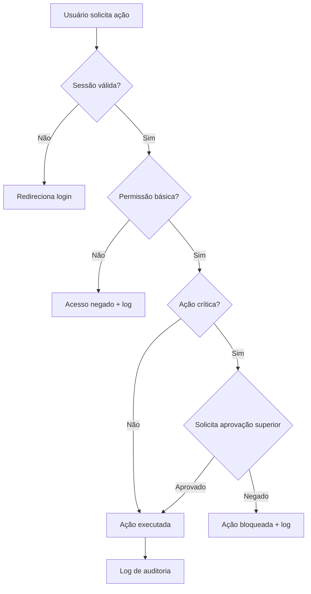

# Regras de Negócio — Autorização

## Fluxo da Regra

1. Definição de perfis e permissões (roles) no sistema.
2. Atribuição de perfis a usuários (individual ou por grupo).
3. No momento da ação, o sistema verifica se o usuário possui a permissão necessária.
4. Ações críticas exigem autorização em cascata (supervisor/gerente).
5. Log de todas as autorizações concedidas e negadas.
6. Revisão periódica de acessos.

## Pré-condições

- Perfis e permissões mapeados e configurados.
- Usuário autenticado no sistema.
- Sessão ativa e dentro do horário permitido.
- Módulo/ação protegido por política de autorização.

## Pós-condições

- Ação autorizada ou negada registrada em log.
- Sessão do usuário com escopo de permissão definido.
- Operações críticas rastreáveis com identificação do autorizador.

## Exceções

- **Token expirado:** redireciona para login.
- **Permissão insuficiente:** exibe mensagem e registra tentativa.
- **Supervisor indisponível para aprovação:** ação fica pendente com timeout.
- **Tentativa repetida de acesso negado:** pode disparar bloqueio temporário.
- **Escalação de privilégio detectada:** alerta segurança e revoga sessão.

## Casos Especiais

- Autorização temporária (ex.: cobertura de férias).
- Delegação de aprovação (supervisor delega a outro).
- Aprovação em lote (ex.: aprovar múltiplos descontos de uma vez).
- Autorização offline (PDV desconectado, sincroniza depois).
- Dupla autenticação para ações críticas (ex.: exclusão de registros).
- Permissão por horário (ex.: só pode abrir caixa no horário comercial).

## Regras Fiscais

- Acesso a informações fiscais restrito a perfis contábeis/fiscais.
- Auditoria de acessos para compliance (SOX, LGPD).
- Certificação digital para assinatura de documentos fiscais.
- Segregação de função (quem vende não pode aprovar desconto próprio).

## Regras por Cliente

(não se aplicam diretamente.)

## Diagramas

