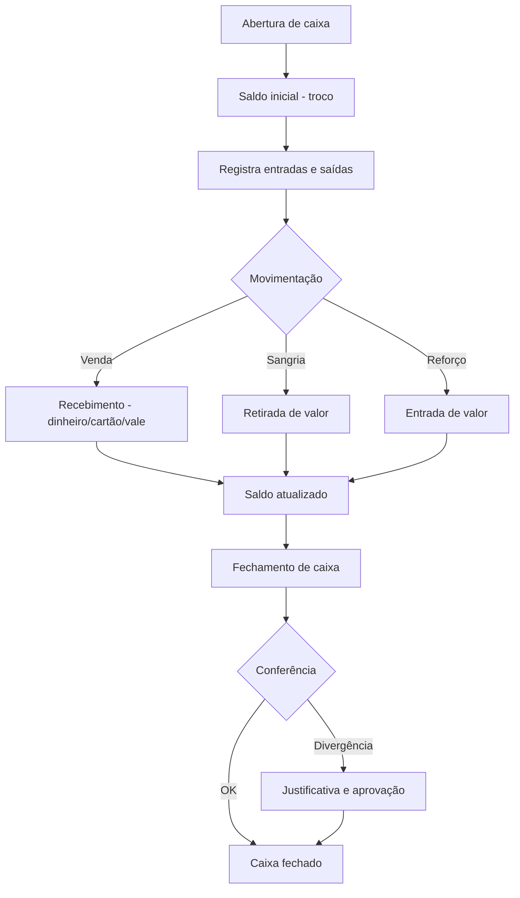

# Regras de Negócio — Caixa

## Fluxo da Regra

1. Abertura de caixa: operador informa saldo inicial (troco).
2. Durante o expediente, todas as entradas (vendas, recebimentos) e saídas (despesas, sangrias) são registradas.
3. O sistema vincula cada movimentação a um operador e a uma forma de pagamento.
4. Fechamento de caixa: conferência do saldo físico vs. saldo sistêmico.
5. Divergências são justificadas e aprovadas pelo supervisor.
6. O fechamento gera um relatório de fechamento (resumo do movimento).

## Pré-condições

- Operador de caixa cadastrado e com permissão ativa.
- Caixa físico (PDV) configurado e vinculado ao operador.
- Meios de pagamento habilitados no sistema.
- Saldo de abertura informado.
- Turno/frente de caixa definido.

## Pós-condições

- Todas as movimentações do turno registradas.
- Saldo de fechamento calculado.
- Divergências registradas com justificativa.
- Relatório de fechamento gerado e armazenado.
- Caixa disponível para nova abertura.

## Exceções

- **Divergência de fechamento sem justificativa:** bloqueia fechamento até aprovação de supervisor.
- **Saldo negativo durante o turno:** alerta operador e supervisor.
- **Falha de comunicação com PDV:** opera offline com sincronização posterior.
- **Cancelamento de venda já fechada:** exige estorno no caixa e autorização.
- **Sangria não autorizada:** bloqueia operação.

## Casos Especiais

- Troco insuficiente (requer sangria reversa / reforço de caixa).
- Pagamento com múltiplos vales (alimentação, refeição, presente).
- Venda com cheque (pré-datado).
- Fechamento parcial (parcial do turno para conferência intermediária).
- Transferência de valores entre caixas.
- Operador substituto durante o turno.

## Regras Fiscais

- Emissão de NFC-e vinculada ao caixa.
- Registro de meios de pagamento na nota fiscal (Lei 13.097/2015).
- Limite de faturamento para MEI/Simples Nacional (impacto no regime).
- Obrigatoriedade de memória fiscal (cupom eletrônico).

## Regras por Cliente

(não se aplicam diretamente ao caixa.)

- Cliente com crédito próprio pode usar conta corrente interna (registro no caixa como "conta cliente").

## Diagramas

