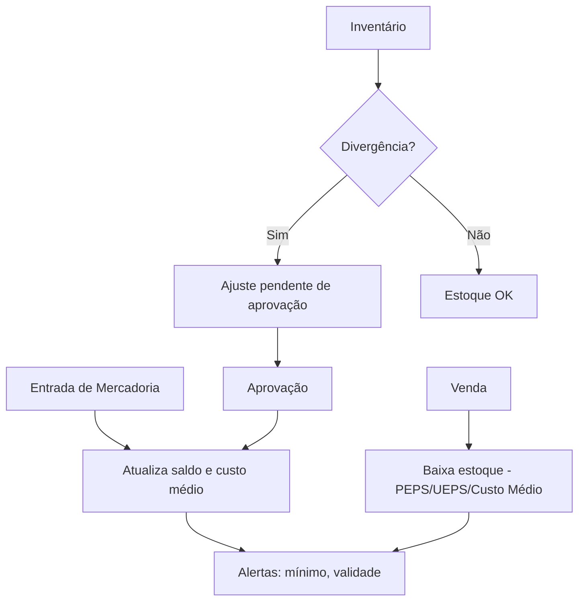

# Regras de Negócio — Estoque

## Fluxo da Regra

1. Entrada de mercadoria (compra, devolução de cliente, transferência entre filiais, produção).
2. O sistema registra o item, quantidade, lote, validade e localização.
3. Saída de mercadoria (venda, devolução a fornecedor, transferência, perda).
4. Inventário (cíclico ou geral) confronta saldo físico × saldo sistêmico.
5. Ajustes de estoque corrigem divergências com justificativa.
6. Alertas de estoque mínimo e validade próxima são disparados.

## Pré-condições

- Produto cadastrado com código, unidade de medida e classificação fiscal.
- Locais de armazenagem definidos (depósitos, prateleiras).
- Usuário com permissão de movimentação de estoque.
- Fornecedor cadastrado (para entrada por compra).
- Política de avaliação de estoque definida (PEPS, UEPS, Custo Médio).

## Pós-condições

- Saldo de estoque atualizado em tempo real.
- Custo médio do produto recalculado (se aplicável).
- Histórico de movimentação (entrada/saída) rastreável.
- Inventário registrado com divergências e ajustes.
- Alertas de reposição gerados.

## Exceções

- **Divergência de inventário:** gera ajuste pendente de aprovação.
- **Produto vencido:** bloqueia venda e notifica para descarte.
- **Lote não localizado:** impede movimentação até correção.
- **Quantidade negativa:** bloqueia venda e gera alerta crítico.
- **Código de barras não reconhecido:** permite cadastro rápido ou rejeita.

## Casos Especiais

- Estoque de terceiros (consignação, bonificação).
- Kits e composições (produto composto por múltiplos itens).
- Produto com controle de número de série.
- Perecíveis com controle de validade e FIFO obrigatório.
- Transferência entre filiais com custo de frete.
- Perda por roubo, avaria ou vencimento.

## Regras Fiscais

- Classificação fiscal (NCM/CEST) correta por produto.
- Alíquotas de ICMS, IPI, PIS, COFINS vinculadas ao produto.
- Regime de ST (Substituição Tributária) por NCM e UF.
- Livro de Inventário (obrigação fiscal).
- CIAP (Controle de Crédito de ICMS do Ativo Permanente).

## Regras por Cliente

(não se aplicam diretamente; estoque é interno.)

- Reserva de estoque para cliente específico (venda garantida).
- Lote separado para cliente (ex.: private label).

## Diagramas

