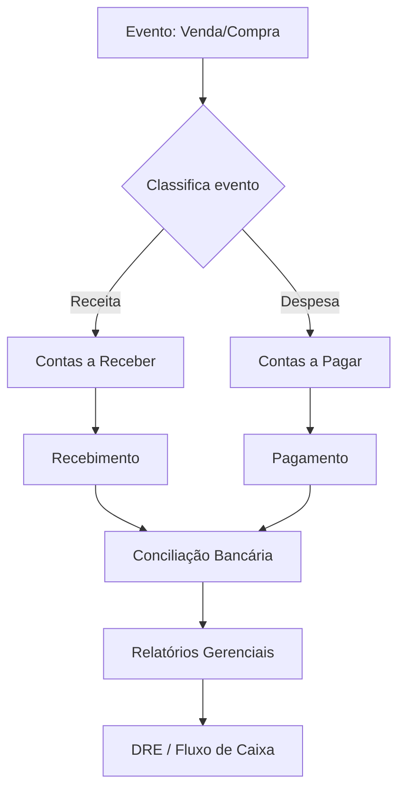

# Regras de Negócio — Financeiro

## Fluxo da Regra

1. Toda movimentação financeira é gerada a partir de eventos de venda, compra ou ajuste manual.
2. O sistema classifica a movimentação (receita, despesa, transferência).
3. Contas a pagar/receber são provisionadas com vencimento e condições.
4. Baixas (pagamentos/recebimentos) conciliam as contas.
5. Conciliação bancária é executada periodicamente.
6. Relatórios gerenciais (DRE, fluxo de caixa) consolidam os dados.

## Pré-condições

- Plano de contas contábil configurado.
- Centros de custo definidos.
- Contas bancárias cadastradas.
- Usuário com permissão financeira.
- Parâmetros de juros, multa e desconto configurados.

## Pós-condições

- Movimentação financeira registrada e conciliável.
- Contas a pagar/receber atualizadas.
- Saldos de contas bancárias refletidos.
- Relatórios gerenciais disponíveis.
- Auditoria (log) de toda operação financeira.

## Exceções

- **Pagamento duplicado:** sistema detecta e bloqueia.
- **Saldo insuficiente para baixa:** notifica e impede a operação.
- **Divergência de conciliação:** gera pendência para ajuste manual.
- **Boleto vencido não pago:** aplica juros/multa conforme configuração.
- **Estorno de recebimento:** rastreia e reverte lançamentos vinculados.

## Casos Especiais

- Pagamento antecipado com desconto financeiro.
- Renegociação de dívida (parcelamento).
- Provisão de férias, 13º e encargos (se aplicável ao escopo).
- Rateio de despesas entre centros de custo.
- Adiantamento a fornecedores.
- Múltiplas contas bancárias com transferência entre elas.

## Regras Fiscais

- Retenção de IR, CSLL, PIS, COFINS, INSS sobre pagamentos a fornecedores.
- Apuração de impostos sobre receita (regime Lucro Real, Presumido, Simples).
- Obrigações acessórias (SPED Contábil, SPED Fiscal).
- Prazos legais para recolhimento de impostos.
- Emissão de nota fiscal de serviço (NFS-e) quando aplicável.

## Regras por Cliente

- Limite de crédito para vendas a prazo.
- Tabela de juros e multa personalizada por contrato.
- Condições de desconto financeiro por antecipação.
- Bloqueio automático por inadimplência acima de N dias.
- Relatório de extrato do cliente.

## Diagramas

