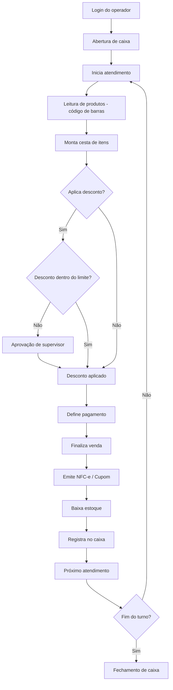

# Regras de Negócio — PDV

## Fluxo da Regra

1. Operador faz login no PDV e abre o caixa com saldo inicial.
2. Inicia atendimento: leitura de código de barras ou busca de produto.
3. Sistema monta a cesta (itens, quantidades, subtotais).
4. Aplica descontos (percentual, valor, promocional) conforme permissão.
5. Define forma de pagamento (dinheiro, cartão, vale, múltiplos).
6. Finaliza venda: emite cupom/NFC-e, baixa estoque, registra no caixa.
7. PDV pronto para próximo atendimento.
8. Fechamento de caixa no final do turno.

## Pré-condições

- PDV configurado com hardware (leitor de código de barras, impressora, gaveta de dinheiro, pinpad).
- Operador autenticado com permissão de PDV.
- Caixa aberto com saldo inicial.
- Tabelas de preço e imposto sincronizadas.
- Sistema online ou com capacidade offline configurada.

## Pós-condições

- Venda registrada com cupom/NFC-e emitido.
- Estoque baixado.
- Movimentação de caixa registrada.
- Comprovante entregue ao cliente.
- PDV liberado para próximo atendimento.

## Exceções

- **Leitura de código de barras falha:** permite digitação manual ou busca.
- **Impressora sem papel/offline:** reimprime ou gera PDF do cupom.
- **Queda de conexão:** opera offline e sincroniza ao reconectar.
- **Cancelamento de item/venda:** exige permissão específica e justificativa.
- **Desconto acima do limite:** requer aprovação de supervisor.
- **Gaveta de dinheiro não abre:** alerta operador.

## Casos Especiais

- Venda com múltiplas formas de pagamento na mesma transação.
- Troco em dinheiro com valor parcial pago em cartão.
- Venda com vale (alimentação, refeição, presente, troca).
- Devolução no PDV (estorno total ou parcial).
- Venda suspensa (cliente busca mais itens; venda fica em espera).
- Desconto por item × desconto no total.
- PDV de autoatendimento (self-checkout).

## Regras Fiscais

- NFC-e (Nota Fiscal de Consumidor Eletrônica) obrigatória.
- SAT (Sistema Autenticador e Transmissor) conforme legislação estadual.
- TEF (Transferência Eletrônica de Fundos) para cartões.
- Registro de meios de pagamento na NFC-e.
- Tempo máximo de emissão da NFC-e (contingência offline).
- Assinatura digital do cupom fiscal.

## Regras por Cliente

- Cliente identificado: CPF na nota.
- Cliente com crédito próprio: uso de conta corrente na finalização.
- Cliente fidelidade: acúmulo e resgate de pontos no PDV.
- Cliente com desconto personalizado aplicado automaticamente.

## Diagramas

