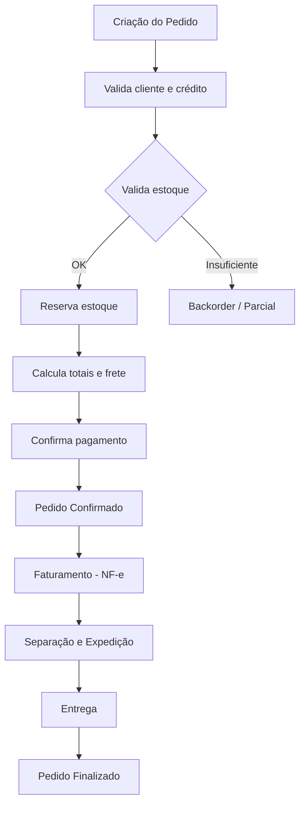

# Regras de Negócio — Pedidos

## Fluxo da Regra

1. Criação do pedido: cliente, itens, quantidades, endereço de entrega.
2. Validação: estoque, crédito do cliente, disponibilidade de entrega.
3. Cálculo: subtotal, descontos, frete, impostos, total.
4. Confirmação do pedido e reserva de estoque.
5. Faturamento: emissão de nota fiscal e separação.
6. Expedição e entrega com rastreamento.
7. Finalização (entrega confirmada) e baixa definitiva de estoque.

## Pré-condições

- Cliente cadastrado e ativo.
- Produtos disponíveis com saldo de estoque.
- Endereço de entrega válido.
- Meio de pagamento autorizado.
- Usuário com permissão de criação de pedido.

## Pós-condições

- Pedido registrado com número único e status.
- Estoque reservado (ou baixado, dependendo da política).
- Financeiro provisionado (contas a receber).
- Nota fiscal emitida (quando faturado).
- Logística acionada para separação e expedição.

## Exceções

- **Estoque insuficiente:** permite pedido parcial ou coloca em backorder.
- **Cliente com crédito bloqueado:** impede criação ou requer aprovação.
- **Endereço fora da área de entrega:** notifica e impede prosseguimento.
- **Falha no gateway de pagamento:** mantém pedido pendente de pagamento.
- **Cancelamento pós-faturamento:** exige fluxo de devolução e estorno.

## Casos Especiais

- Pedido com múltiplos endereços de entrega.
- Pedido programado (entrega futura).
- Pedido de venda sob encomenda (sem estoque no momento).
- Pedido com itens de fornecedores diferentes (drop shipping).
- Alteração de pedido antes do faturamento.
- Pedido urgente (prioridade de separação e entrega).
- Vale-troca ou crédito como forma de pagamento parcial.

## Regras Fiscais

- CFOP por tipo de operação (venda, remessa, devolução).
- Diferencial de alíquota (DIFAL) para vendas interestaduais a consumidor final.
- Retenção de ICMS-ST quando aplicável.
- Emissão de NF-e antes da circulação da mercadoria.
- Prazo de validade do orçamento (pedido não confirmado expira).

## Regras por Cliente

- Limite de crédito consultado e provisionado.
- Condições de pagamento personalizadas.
- Tabela de preço específica.
- Desconto progressivo por volume.
- Isenção de frete por valor mínimo ou fidelidade.
- Bloqueio de pedido para cliente inadimplente.

## Diagramas

