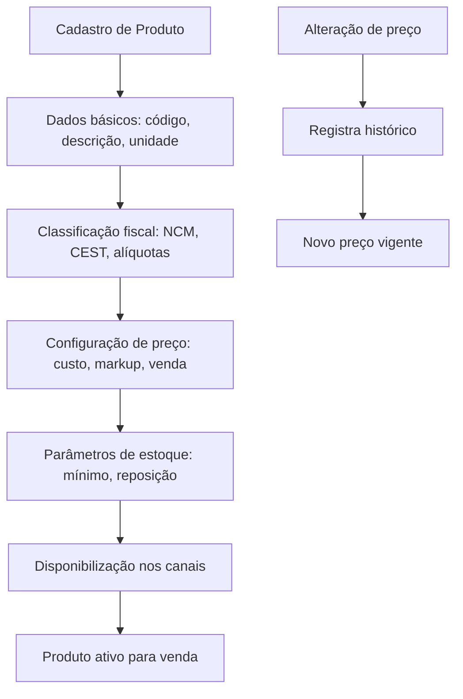

# Regras de Negócio — Produtos

## Fluxo da Regra

1. Cadastro de produto: código, descrição, unidade de medida, classificação fiscal, categoria.
2. Configuração de preço: preço de custo, markup, preço de venda, tabelas diferenciadas.
3. Vinculação fiscal: NCM, CEST, alíquotas, CST, CFOP padrão.
4. Configuração de estoque: estoque mínimo, ponto de reposição, localização, controle de lote/validade.
5. Disponibilização para venda nos canais (PDV, e-commerce).
6. Ciclo de vida: ativo, inativo, descontinuado.

## Pré-condições

- Categorias e subcategorias configuradas.
- Tabelas de imposto parametrizadas.
- Fornecedores cadastrados (para vinculação de produto × fornecedor).
- Usuário com permissão de cadastro de produto.
- Código de barras (EAN/GTIN) único.

## Pós-condições

- Produto disponível para venda e movimentação de estoque.
- Preço vigente registrado com histórico de alterações.
- Classificação fiscal vinculada e válida.
- Estoque inicial zerado (ou ajustado via entrada).
- Auditoria de criação/alteração registrada.

## Exceções

- **Código de barras duplicado:** bloqueia cadastro e notifica.
- **NCM inexistente ou desatualizado:** alerta para correção fiscal.
- **Produto sem preço de venda:** impede venda e notifica.
- **Alteração de preço retroativa:** não permitida; alterações valem a partir da data/hora.
- **Produto inativo em venda:** bloqueia inclusão em novos pedidos.

## Casos Especiais

- Produto composto (kit): venda do kit com baixa individual dos componentes.
- Produto com variações (cor, tamanho): SKU pai e SKUs filhos.
- Produto controlado por número de série.
- Produto perecível com rastreabilidade de lote e validade.
- Produto de fabricação própria (matéria-prima → produto acabado).
- Produto com embalagem de venda × embalagem de compra (fator de conversão).

## Regras Fiscais

- NCM (Nomenclatura Comum do Mercosul) correto.
- CEST (Código Especificador da Substituição Tributária).
- Alíquotas interestaduais e intraestaduais.
- Regime de ST por produto e UF de destino.
- Alíquota de IPI por produto.
- Inclusão na lista de produtos controlados (ANVISA, MAPA, Exército).

## Regras por Cliente

(não se aplicam diretamente ao cadastro de produto.)

- Produto pode ser marcado como exclusivo para determinado grupo de clientes.
- Preço diferenciado por tabela de cliente.

## Diagramas

