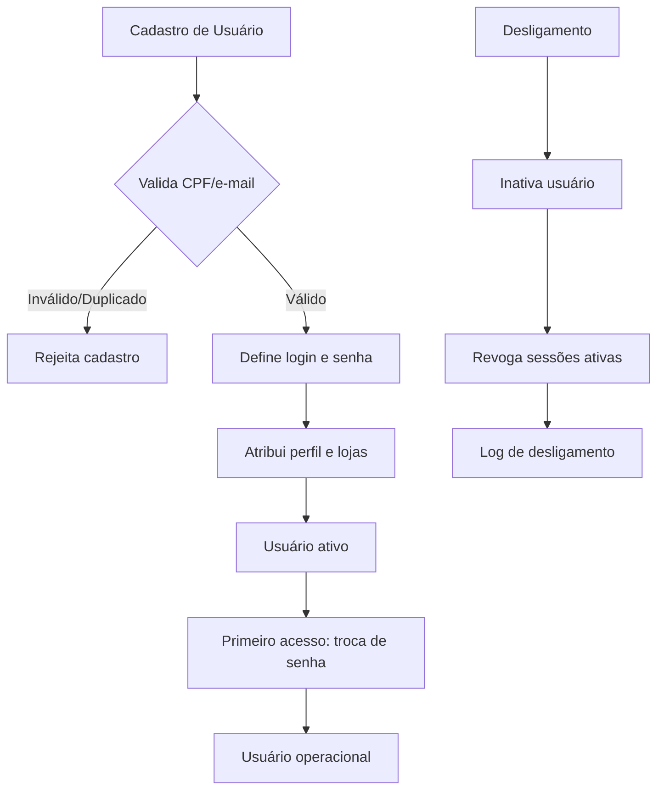

# Regras de Negócio — Usuário

## Fluxo da Regra

1. Cadastro de usuário: dados pessoais, login, senha inicial, perfil(is) de acesso.
2. Validação de dados (CPF/CNPJ, e-mail único, senha forte).
3. Atribuição a grupo(s) e loja(s) / filial(is) de atuação.
4. Ativação do usuário (envio de credenciais, primeiro acesso com troca de senha).
5. Gestão do ciclo de vida: ativo, inativo, bloqueado, férias, desligado.
6. Alteração de dados, perfil e permissões com log.

## Pré-condições

- Perfis e permissões previamente configurados.
- Lojas/filiais cadastradas.
- Política de senha definida (complexidade, expiração, histórico).
- Administrador com permissão de gestão de usuários.

## Pós-condições

- Usuário criado com credenciais únicas.
- Perfis e escopo de loja vinculados.
- Histórico de criação e alterações registrado.
- Usuário apto a realizar login e operar o sistema.

## Exceções

- **CPF/CNPJ já cadastrado:** bloqueia duplicidade.
- **E-mail já em uso:** notifica e impede cadastro.
- **Senha fraca:** rejeita e exibe política de senha.
- **Usuário inativo tentando login:** bloqueia e notifica administrador.
- **Múltiplas tentativas de login com erro:** bloqueio temporário por segurança.
- **Desligamento:** inativação com revogação imediata de sessões ativas.

## Casos Especiais

- Usuário multi-loja (acesso a mais de uma filial).
- Usuário com múltiplos perfis (ex.: vendedor e caixa).
- Usuário temporário (prazo de validade).
- Transferência de loja (muda escopo, mantém histórico).
- Recuperação de senha com verificação em duas etapas.
- Integração com AD/LDAP para autenticação centralizada.

## Regras Fiscais

- LGPD: consentimento para tratamento de dados pessoais.
- Registro de consentimento aceito (termos de uso e privacidade).
- Direito ao esquecimento (exclusão de dados pessoais mediante solicitação).
- Log de acesso a dados pessoais (quem acessou, quando, por quê).
- Dados de login não podem ser compartilhados (política de senha individual).

## Regras por Cliente

(não se aplicam diretamente.)

## Diagramas

