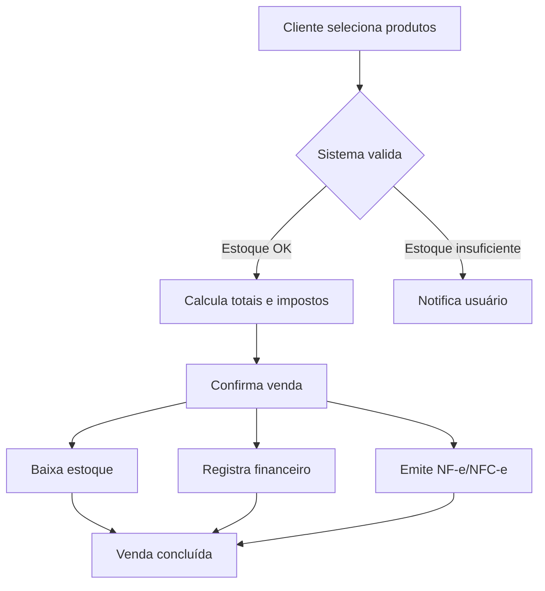

# Regras de Negócio — Vendas

## Fluxo da Regra

1. O cliente seleciona os produtos/itens desejados.
2. O sistema calcula subtotais, descontos aplicáveis e impostos.
3. O vendedor confirma a venda e o sistema gera um registro de venda (pedido/nota).
4. O estoque é atualizado (baixa dos itens vendidos).
5. O financeiro registra a movimentação (contas a receber, recebimento imediato ou faturamento).
6. O cliente recebe o comprovante/nota fiscal.

## Pré-condições

- Cliente deve estar cadastrado (ou venda para consumidor final).
- Produtos devem existir no catálogo e possuir saldo em estoque (salvo política de venda sob encomenda).
- Usuário/vendedor deve possuir permissão de venda.
- Tabelas de preço e impostos devem estar configuradas.
- Meio de pagamento deve estar habilitado.

## Pós-condições

- Venda registrada com número único e status (Concluída, Pendente, Cancelada).
- Estoque atualizado (baixa dos produtos).
- Financeiro provisionado (contas a receber ou recebimento confirmado).
- Histórico de venda vinculado ao cliente e ao vendedor.
- Nota fiscal emitida (quando aplicável).

## Exceções

- **Estoque insuficiente:** bloquear venda ou permitir venda parcial com aviso.
- **Cliente bloqueado (inadimplente):** impedir novas vendas a prazo.
- **Falha na integração fiscal:** reter venda em status Pendente até regularização.
- **Timeout no gateway de pagamento:** permitir retentativa ou cancelamento.
- **Divergência de preço/tabela:** utilizar preço vigente na data/hora da venda.

## Casos Especiais

- Venda com múltiplas formas de pagamento (dinheiro + cartão + vale).
- Venda com desconto acima do limite permitido (requer aprovação de supervisor).
- Devolução parcial/total pós-venda (fluxo de estorno).
- Venda por PDV offline (sincronização posterior).
- Venda consignada.
- Brindes e bonificações.

## Regras Fiscais

- Cálculo de ICMS, PIS, COFINS, ISS conforme regime tributário da empresa e do produto.
- CST e CFOP corretos por tipo de operação (venda interna, interestadual, exportação).
- Retenção de impostos na fonte quando aplicável.
- Emissão de NF-e / NFC-e dentro do prazo legal.
- Regime de Substituição Tributária para produtos elegíveis.

## Regras por Cliente

- Limite de crédito por cliente.
- Tabela de preço diferenciada (atacado, varejo, VIP).
- Condições de pagamento personalizadas (prazo, desconto financeiro).
- Restrições de produtos por cliente (ex.: cliente bloqueado para determinada categoria).
- Acúmulo de pontos / fidelidade.

## Diagramas

