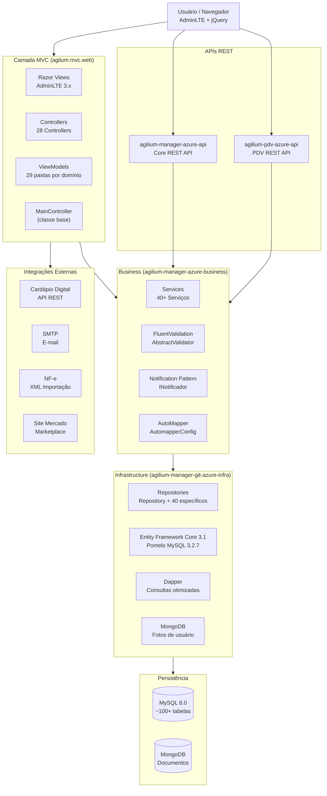
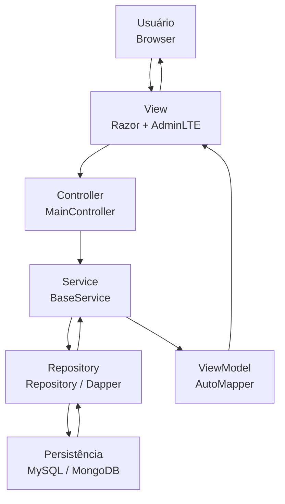
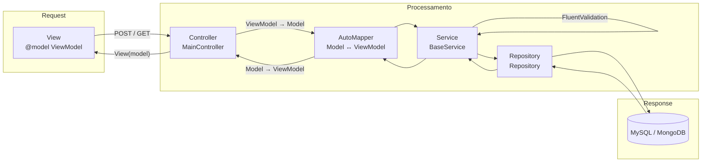
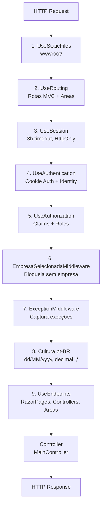
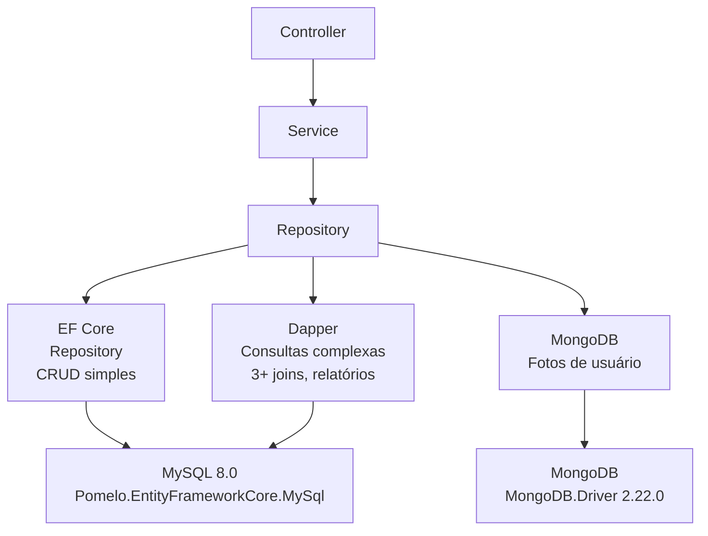
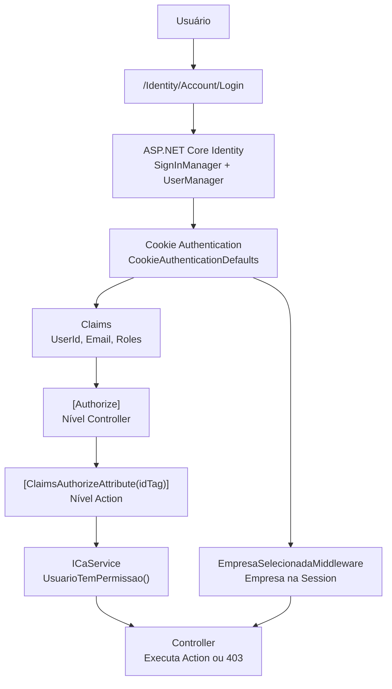

# Arquitetura Geral

## Objetivo

Este documento apresenta a visão arquitetural de alto nível do **Agilium Manager**.

Seu objetivo é fornecer uma visão unificada da estrutura da solução, demonstrando como os componentes estão organizados, como as camadas se comunicam e quais tecnologias participam do fluxo principal de processamento das requisições.

Este documento serve como ponto de entrada para o entendimento da arquitetura do sistema.

---

# Escopo

## Este documento cobre

- Arquitetura em camadas
- Organização geral da solução (6 projetos)
- Fluxo entre camadas
- Componentes principais (28 Controllers, 40+ Services, 40+ Repositories)
- Tecnologias utilizadas (.NET Core 3.1, EF Core, Dapper, MySQL, MongoDB)
- Pipeline principal da aplicação (12 middlewares)
- Fluxo de persistência (EF Core + Dapper + MongoDB)
- Fluxo de autenticação (Cookie Auth + Identity + ClaimsAuthorize)
- Integrações externas (Cardápio Digital, NFe, E-mail, Marketplace)

## Este documento NÃO cobre

- Regras de negócio específicas (ver `docs/dominio/`)
- Diagramas de sequência detalhados (ver `docs/diagrams/sequence.md`)
- Modelagem física do banco de dados (ver `docs/diagrams/banco-de-dados.md`)
- Fluxos específicos de módulos (ver `docs/fluxos/`)
- C4 Model detalhado (ver `docs/diagrams/c4-model.md`)

---

# Índice

- [Visão Geral](#visão-geral)
- [Arquitetura da Solução](#arquitetura-da-solução)
- [Organização das Camadas](#organização-das-camadas)
- [Fluxo Principal](#fluxo-principal)
- [Fluxo MVC](#fluxo-mvc)
- [Pipeline HTTP](#pipeline-http)
- [Persistência](#persistência)
- [Autenticação](#autenticação)
- [Componentes Compartilhados](#componentes-compartilhados)
- [Tecnologias](#tecnologias)
- [Princípios Arquiteturais](#princípios-arquiteturais)
- [Limitações Conhecidas](#limitações-conhecidas)
- [Documentação Relacionada](#documentação-relacionada)

---

# Visão Geral

O **Agilium Manager** é uma aplicação **ASP.NET Core MVC (.NET Core 3.1)** organizada em arquitetura em camadas.

A solução separa responsabilidades entre apresentação, regras de negócio, infraestrutura e persistência, utilizando padrões arquiteturais que favorecem baixo acoplamento, reutilização de componentes e facilidade de manutenção.

Entre os principais componentes identificados estão:

- ASP.NET Core MVC (28 Controllers)
- Razor Views + AdminLTE 3.x
- ViewModels com AutoMapper 8.1.1
- Business Services (40+ serviços)
- Repository Pattern (40+ repositórios)
- Entity Framework Core 3.1 (MySQL via Pomelo)
- Dapper (consultas otimizadas)
- ASP.NET Core Identity + Cookie Authentication
- FluentValidation + Notification Pattern
- Middlewares customizados (EmpresaSelecionada, Exception)
- MySQL 8.0 + MongoDB
- Polly (resiliência HTTP)

---

# Arquitetura da Solução

## Diagrama C4 — Nível Contexto



---

# Organização das Camadas

```text
┌─────────────────────────────────────────────┐
│         APRESENTAÇÃO (MVC)                   │
│  agilum.mvc.web                              │
│                                              │
│  ├── Controllers (28, herdam MainController) │
│  ├── Views (Razor + AdminLTE 3.x)            │
│  ├── ViewModels (29 pastas por domínio)      │
│  ├── Areas/Identity (Razor Pages)            │
│  └── wwwroot/ (AdminLTE, CSS, JS, libs)      │
└──────────────────┬──────────────────────────┘
                   │
                   ▼
┌─────────────────────────────────────────────┐
│              NEGÓCIO (Business)              │
│  agilium-manager-azure-business              │
│                                              │
│  ├── Services (40+, herdam BaseService)      │
│  ├── Models (100+ entidades)                 │
│  ├── Validations (FluentValidation)          │
│  ├── Interfaces (IService, IRepository)      │
│  ├── Notificacoes (Notification Pattern)     │
│  └── Enums (33 enums de domínio)             │
└──────────────────┬──────────────────────────┘
                   │
                   ▼
┌─────────────────────────────────────────────┐
│        INFRAESTRUTURA (Infrastructure)       │
│  agilium-manager-git-azure-infra             │
│                                              │
│  ├── Repository (Repository<T> + 40 espec.)  │
│  ├── Repository/Dapper (consultas SQL)        │
│  ├── Context/AgiliumContext (EF Core)         │
│  ├── Context/ConnectionFactory (Dapper)       │
│  ├── Mappings (Fluent API)                   │
│  └── ViewModelDapper (DTOs para Dapper)       │
└──────────────────┬──────────────────────────┘
                   │
                   ▼
┌─────────────────────────────────────────────┐
│           BANCO DE DADOS                     │
│                                              │
│  ├── MySQL 8.0 (~100+ tabelas)               │
│  │     └── Pomelo.EntityFrameworkCore.MySql  │
│  └── MongoDB (fotos de usuário)              │
│        └── MongoDB.Driver 2.22.0             │
└─────────────────────────────────────────────┘
```

---

# Fluxo Principal



---

# Fluxo MVC



---

# Pipeline HTTP

Pipeline real configurado em `Startup.Configure()`:



---

# Persistência



### Estratégia de Acesso

| Abordagem | Quando Usar | Exemplo |
|-----------|-------------|---------|
| EF Core (`Repository<T>`) | CRUD, 1-2 joins | `Adicionar()`, `ObterPorId()` |
| Dapper | 3+ joins, relatórios | `ObterCompraPaginado()` |
| MongoDB | Documentos, GridFS | `UsuarioFoto` |

---

# Autenticação



### Configuração

| Recurso | Configuração |
|---------|--------------|
| Cookie | HttpOnly, 3h expiry, SlidingExpiration |
| Session | 3h idle timeout, Essential |
| Senha | Mín. 6 caracteres, exige dígito |
| Lockout | 5 tentativas → 5 minutos |
| Permissão | `ClaimsAuthorizeAttribute(idTag)` por ação |

---

# Componentes Compartilhados

Os principais componentes compartilhados identificados na solução são:

| Componente | Localização | Responsabilidade |
|------------|-------------|------------------|
| `MainController` | `agilum.mvc.web/Controllers/` | INotificador, IMapper, IUser, ILogService, ILicencaService, IAuthService |
| `BaseService` | `agilium-manager-azure-business/Services/` | INotificador, ExecutarValidacao() |
| `Repository<T>` | `agilium-manager-git-azure-infra/Repository/` | CRUD genérico via EF Core |
| `INotificador` | `agilium-manager-azure-business/Notificacoes/` | Notification Pattern |
| `AutomapperConfig` | `agilum.mvc.web/Configuration/` | Mapeamento Model ↔ ViewModel |
| `FluentValidation` | `agilium-manager-azure-business/Models/Validations/` | Validação de domínio |
| `ResolveDependencyConfig` | `agilum.mvc.web/Configuration/` | Registro de DI (80+ serviços) |
| `ExceptionMiddleware` | `agilum.mvc.web/Extensions/` | Tratamento centralizado de exceções |
| `EmpresaSelecionadaMiddleware` | `agilum.mvc.web/Extensions/` | Controle de multi-empresa |
| `IdentityConfig` | `agilum.mvc.web/Configuration/` | Identity Core + Cookie Auth |
| `MvcConfig` | `agilum.mvc.web/Configuration/` | ModelBinding pt-BR + AntiForgery |

---

# Tecnologias

## Backend

| Tecnologia | Versão | Uso |
|------------|--------|-----|
| .NET Core | 3.1 | Runtime |
| ASP.NET Core MVC | 3.1 | Framework Web |
| Entity Framework Core | 3.1.32 | ORM principal |
| Pomelo MySQL | 3.2.7 | Provider EF Core → MySQL |
| Dapper | (via Infra) | Micro-ORM para queries complexas |
| ASP.NET Core Identity | 3.1.32 | Autenticação e autorização |
| AutoMapper | 8.1.1 | Mapeamento Model ↔ ViewModel |
| FluentValidation | (via Business) | Validação de domínio |
| Polly | 6.0.36 | Resiliência HTTP |
| KissLog | 5.1.2 (API) | Logging |
| BouncyCastle | 1.8.9 | Criptografia |
| MongoDB Driver | 2.22.0 (API) | Banco NoSQL |

## Frontend

| Tecnologia | Uso |
|------------|-----|
| Razor Views | Renderização server-side |
| AdminLTE 3.x | Template administrativo |
| Bootstrap 4.5/4.6 | Framework CSS |
| jQuery 3.6.0 | Manipulação DOM e AJAX |
| DataTables | Tabelas paginadas |
| Select2 | Dropdowns com busca |
| Chart.js | Gráficos |
| Toastr | Notificações |
| SweetAlert2 | Diálogos modais |
| Inputmask | Máscaras (CPF, CNPJ, moeda) |

## Banco de Dados

| Banco | Provider | Uso |
|-------|----------|-----|
| MySQL 8.0 | Pomelo EF Core 3.2.7 | Dados relacionais principais |
| MongoDB | MongoDB.Driver 2.22.0 | Documentos e fotos |

---

# Princípios Arquiteturais

A solução segue os seguintes princípios arquiteturais identificados durante o levantamento:

| Princípio | Aplicação |
|-----------|-----------|
| **Separação de responsabilidades** | MVC → Business → Infra |
| **Arquitetura em camadas** | Apresentação, Negócio, Infraestrutura, Dados |
| **Repository Pattern** | `Repository<T>` genérico + 40 específicos |
| **Unit of Work** | Implícito via DbContext Scoped |
| **Injeção de Dependência** | Nativo ASP.NET Core, `ResolveDependencyConfig.cs` |
| **Notification Pattern** | `INotificador` — erros de negócio sem exceções |
| **FluentValidation** | `AbstractValidator<T>` — validação de domínio |
| **AutoMapper** | `AutomapperConfig.cs` — Model ↔ ViewModel |
| **Base Controller** | `MainController` — 8 serviços compartilhados |
| **Base Service** | `BaseService` — `ExecutarValidacao()` |
| **Middleware Pipeline** | EmpresaSelecionada, Exception |
| **Tratamento centralizado de exceções** | `ExceptionMiddleware` |

---

# Limitações Conhecidas

O levantamento técnico confirmou a estrutura geral da solução e seus principais componentes.

Entretanto, ainda não foram documentados neste nível:

- Diagramas específicos de cada módulo (ver `docs/diagrams/`)
- Modelo físico completo do banco de dados (ver `docs/diagrams/banco-de-dados.md`)
- Diagramas de sequência por funcionalidade (ver `docs/diagrams/sequence.md`)
- Arquitetura detalhada das integrações externas (ver `docs/diagrams/integracoes.md`)

Limitações arquiteturais conhecidas:

- **.NET Core 3.1** fora de suporte desde dez/2022
- **MainController** com 8 dependências — acoplamento elevado
- **AutomapperConfig** monolítico — único arquivo para todos os domínios
- **ResolveDependencyConfig** monolítico — todos os registros de DI em uma classe
- **AutenticacaoService** com métodos `NotImplementedException`

---

# Documentação Relacionada

| Documento | Localização |
|-----------|-------------|
| Arquitetura MVC | [mvc.md](./mvc.md) |
| Request Pipeline | [request-pipeline.md](./request-pipeline.md) |
| Autenticação | [autenticacao.md](./autenticacao.md) |
| Persistência | [persistencia.md](./persistencia.md) |
| Banco de Dados | [banco-de-dados.md](./banco-de-dados.md) |
| C4 Model | [c4-model.md](./c4-model.md) |
| Dependency Injection | [dependency-injection.md](./dependency-injection.md) |
| Componentes | [componentes.md](./componentes.md) |
| Integrações | [integracoes.md](./integracoes.md) |
| Frontend | [frontend.md](./frontend.md) |
| Backend | [backend.md](./backend.md) |
| Deployment | [deployment.md](./deployment.md) |
| Infraestrutura | [infraestrutura.md](./infraestrutura.md) |
| Technical Reference | [../agilum-mvc-web-technical-reference.md](../agilum-mvc-web-technical-reference.md) |
| Domínios | [../dominio/README.md](../dominio/README.md) |
| Fluxos | [../fluxos/](../fluxos/) |
| Padrões | [../padroes/](../padroes/) |

