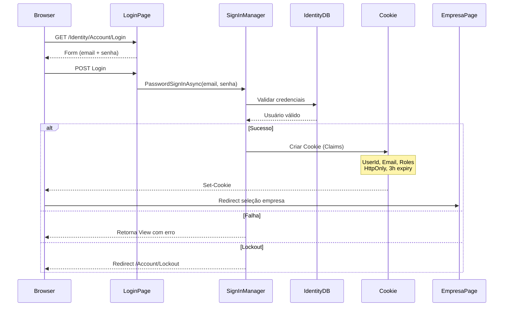
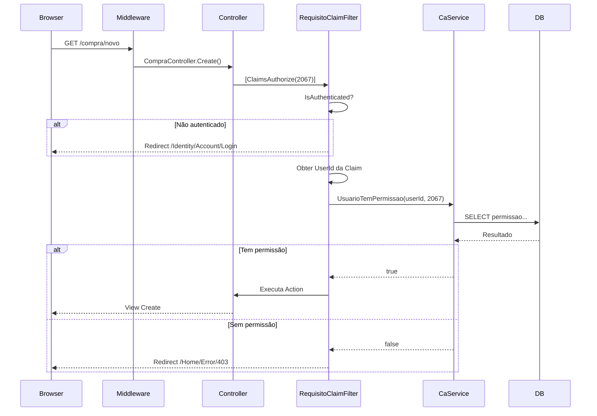

# Diagrama: Autenticação

## Objetivo

Representar o fluxo de autenticação e autorização do Agilium Manager, incluindo login, Cookie Auth, Claims e `ClaimsAuthorizeAttribute`.

---

## Fluxo de Login



---

## Fluxo de Autorização (ClaimsAuthorizeAttribute)



---

## Configuração de Cookie e Sessão

```mermaid
graph TD
    subgraph "Identity"
        IdentityCore["AddIdentityCore<br/>CaUsuarioIdentity"]
        Roles["AddRoles<br/>IdentityRole"]
        SignIn["SignInManager"]
        UserMgr["UserManager"]
    end

    subgraph "Cookie Auth"
        Cookie["CookieAuthenticationDefaults"]
        Cookie --> Login["LoginPath: /Identity/Account/Login"]
        Cookie --> Logout["LogoutPath: /Identity/Account/Logout"]
        Cookie --> Denied["AccessDeniedPath: /Identity/Account/AccessDenied"]
        Cookie --> HttpOnly["HttpOnly: true"]
        Cookie --> Expire["ExpireTimeSpan: 3 horas"]
        Cookie --> Sliding["SlidingExpiration: true"]
    end

    subgraph "Session"
        Session["AddSession"]
        Session --> Timeout["IdleTimeout: 3 horas"]
        Session --> Essential["IsEssential: true"]
    end

    IdentityCore --> Cookie
    Roles --> IdentityCore
    SignIn --> IdentityCore
    UserMgr --> IdentityCore
```

---

## Para Preencher

> **TODO:** Adicionar diagrama de refresh token e fluxo de logout.
