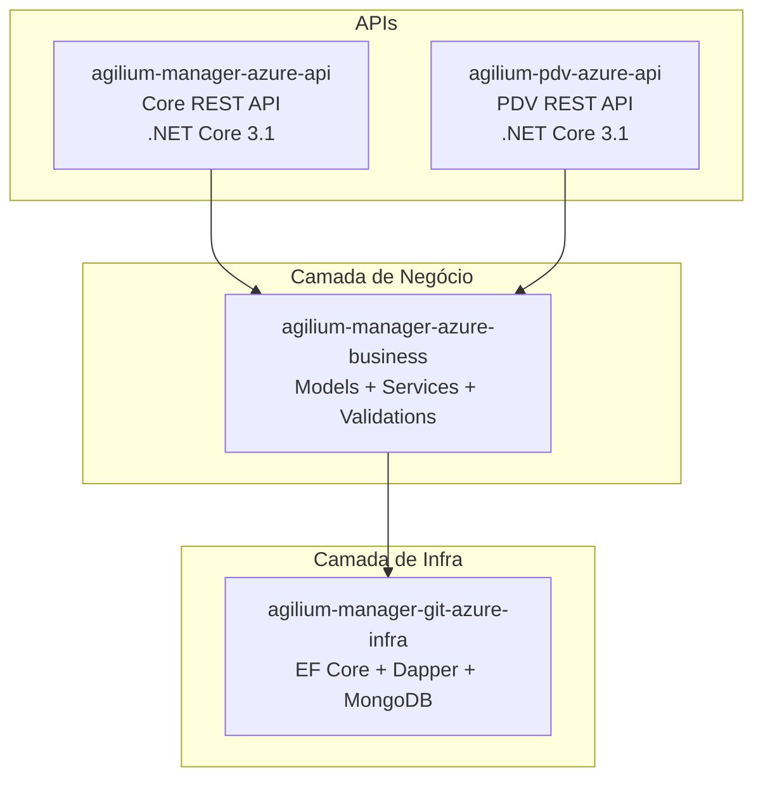
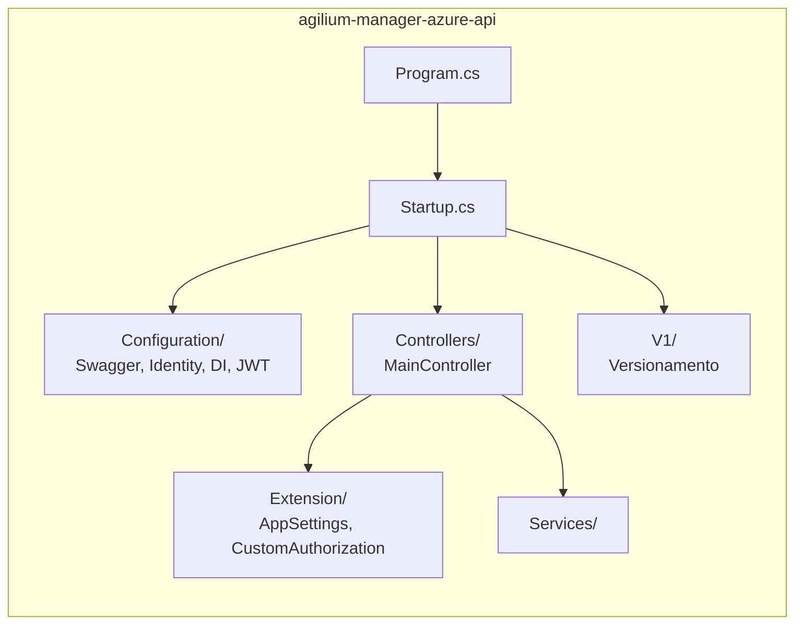
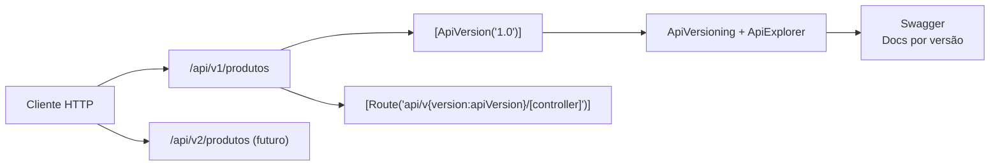
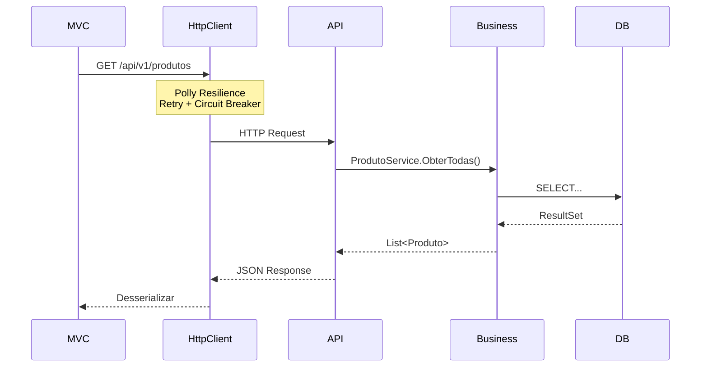

# Diagrama: Backend

## Objetivo

Representar a arquitetura do backend do Agilium Manager, incluindo APIs REST, camada de serviços e comunicação entre projetos.

---

## Projetos Backend

---

## Estrutura da API

---

## Versionamento da API

---

## Comunicação MVC ↔ API

---

## Para Preencher

> **TODO:** Adicionar diagrama detalhado dos endpoints da API com versões e autenticação.
