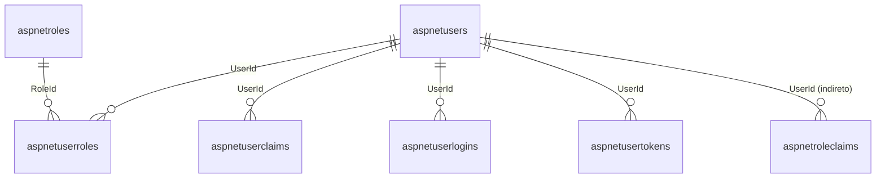

# Diagrama: Banco de Dados

## Objetivo

Representar o modelo de banco de dados do Agilium Manager, incluindo os principais agrupamentos de entidades e seus relacionamentos.

---

## Agrupamento de Entidades

```mermaid
graph TD
    subgraph "Cadastros"
        Empresa["empresa"]
        Usuario["usuario"]
        Funcionario["funcionario"]
        Cliente["cliente / clientepf / clientepj"]
        Fornecedor["fornecedor"]
    end

    subgraph "Produtos e Estoque"
        Produto["produto"]
        CodigoBarra["produto_codigo_barra"]
        Preco["produto_preco"]
        Grupo["grupo_produto / subgrupo"]
        Departamento["produto_departamento"]
        Marca["produto_marca"]
        Estoque["estoque / estoque_produto"]
        Unidade["unidade"]
    end

    subgraph "Operacional (PDV)"
        Turno["turno"]
        Caixa["caixa / caixa_movimento / caixa_moeda"]
        Venda["venda / venda_item / venda_moeda"]
        VendaFiscal["venda_fiscal"]
        Pedido["pedido / pedido_item"]
        Vale["vale"]
        FormaPag["forma_pagamento"]
    end

    subgraph "Compras e Fiscal"
        Compra["compra / compra_item / compra_fiscal"]
        NFe["nota_fiscal_inutil"]
        Cfop["cfop"]
        Cst["cst"]
        Csosn["csosn"]
        Ncm["ncm"]
        Cest["cest_ncm"]
        Ibpt["ibpt"]
    end

    subgraph "Financeiro"
        ContaPagar["conta_pagar"]
        ContaReceber["conta_receber"]
        PlanoConta["plano_conta"]
        Categoria["categoria_financeira"]
        Moeda["moeda"]
    end

    subgraph "Sistema"
        Config["config"]
        Licenca["licenca"]
        Log["log_sistema / log_erro"]
    end

    Empresa --> Produto
    Empresa --> Venda
    Empresa --> Compra
    Empresa --> Turno
    Empresa --> Usuario

    Produto --> Venda
    Produto --> Compra
    Produto --> Estoque

    Fornecedor --> Compra
    Cliente --> Venda
    Cliente --> Pedido

    Turno --> Caixa
    Caixa --> Venda

    Compra --> ContaPagar
    Venda --> ContaReceber
    
    Ncm --> Produto
    Cfop --> Compra
    Cfop --> VendaFiscal
```

---

## Tabelas Identity (dbIdentityContext)

---

## Tecnologias

| Componente | Provider |
|------------|----------|
| MySQL 8.0 | Pomelo.EntityFrameworkCore.MySql 3.2.7 |
| MongoDB | MongoDB.Driver 2.22.0 |
| Migrations | EF Core Tools + `dotnet ef` |

---

## Para Preencher

> **TODO:** Adicionar diagrama ER detalhado com colunas, tipos de dados e constraints de cada tabela principal.
