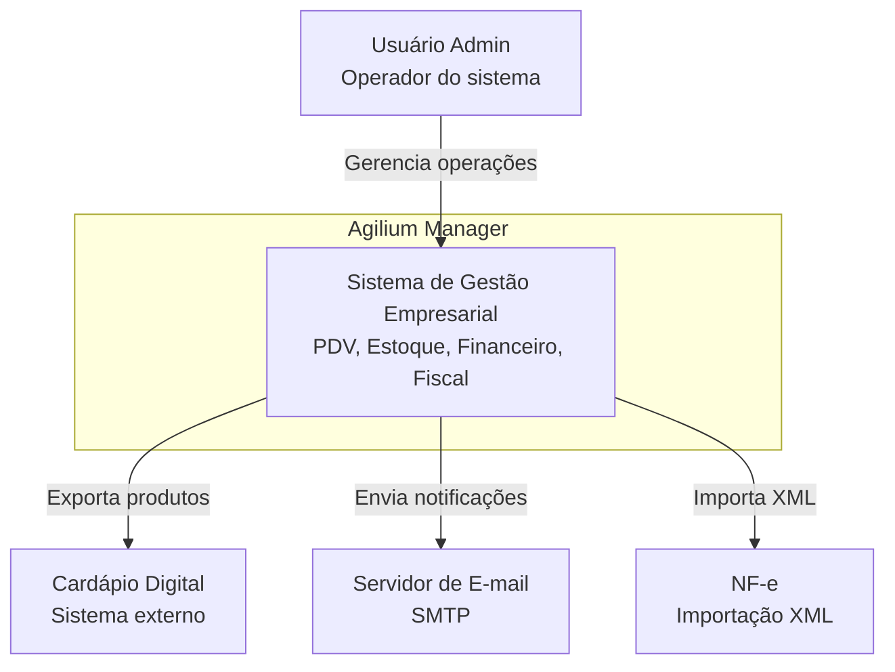
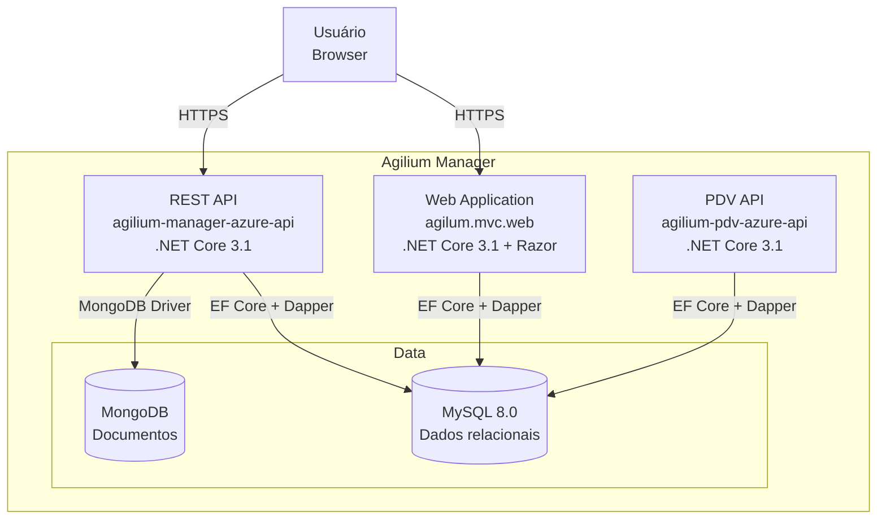
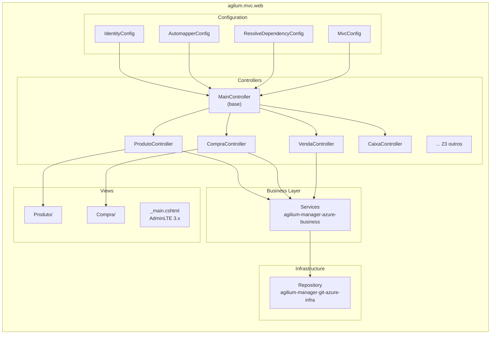
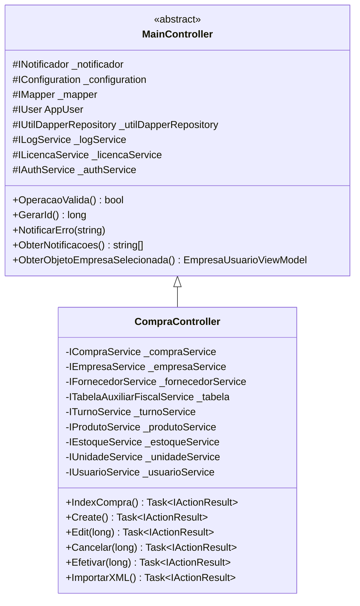

# Diagrama: C4 Model

## Objetivo

Representar a arquitetura do Agilium Manager utilizando o **modelo C4** (Context, Container, Component, Code), que fornece quatro níveis de abstração para documentar sistemas de software.

---

## Nível 1: Contexto (System Context)

---

## Nível 2: Containers

---

## Nível 3: Componentes (MVC Web)

---

## Nível 4: Código (Exemplo: CompraController)

---

## Para Preencher

> **TODO:** Adicionar diagramas C4 dos níveis 3 e 4 para as APIs e para o módulo de Vendas.
