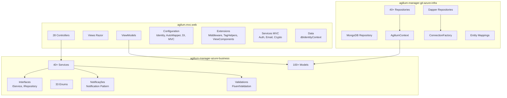
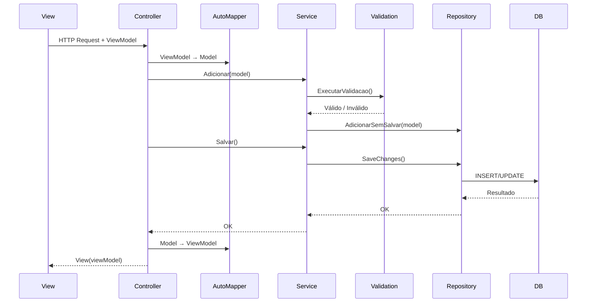

# Diagrama: Componentes

## Objetivo

Representar os principais componentes do sistema Agilium Manager, seus relacionamentos e a comunicação entre eles.

---

## Componentes por Projeto

---

## Comunicação entre Componentes

---

## Para Preencher

> **TODO:** Adicionar diagrama de componentes detalhado por módulo de negócio.
