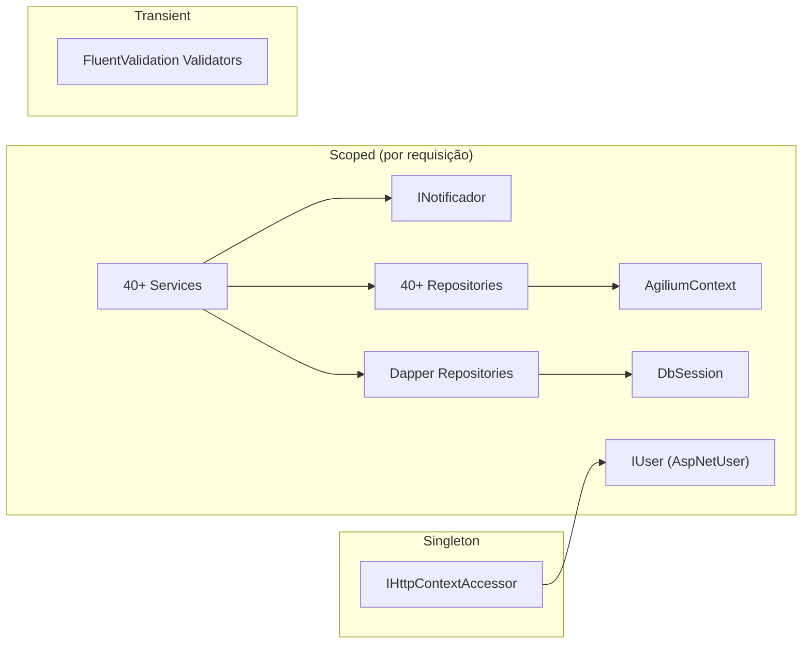
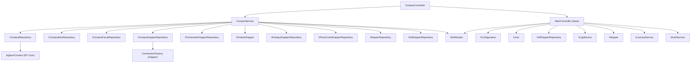
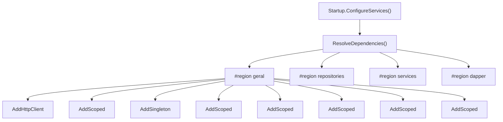

# Diagrama: Dependency Injection

## Objetivo

Representar o grafo de injeção de dependências do Agilium Manager, mostrando como os serviços, repositórios e componentes são registrados e resolvidos.

---

## Ciclo de Vida

---

## Grafo de Dependências — Compra

---

## Registro no Contêiner

---

## Para Preencher

> **TODO:** Adicionar lista completa de todos os registros por categoria.
