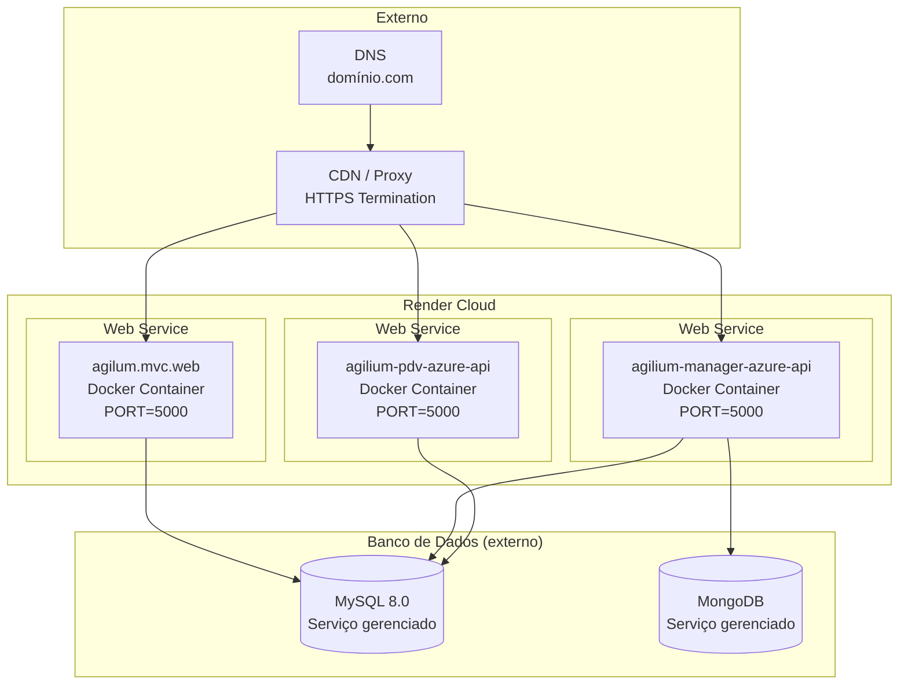
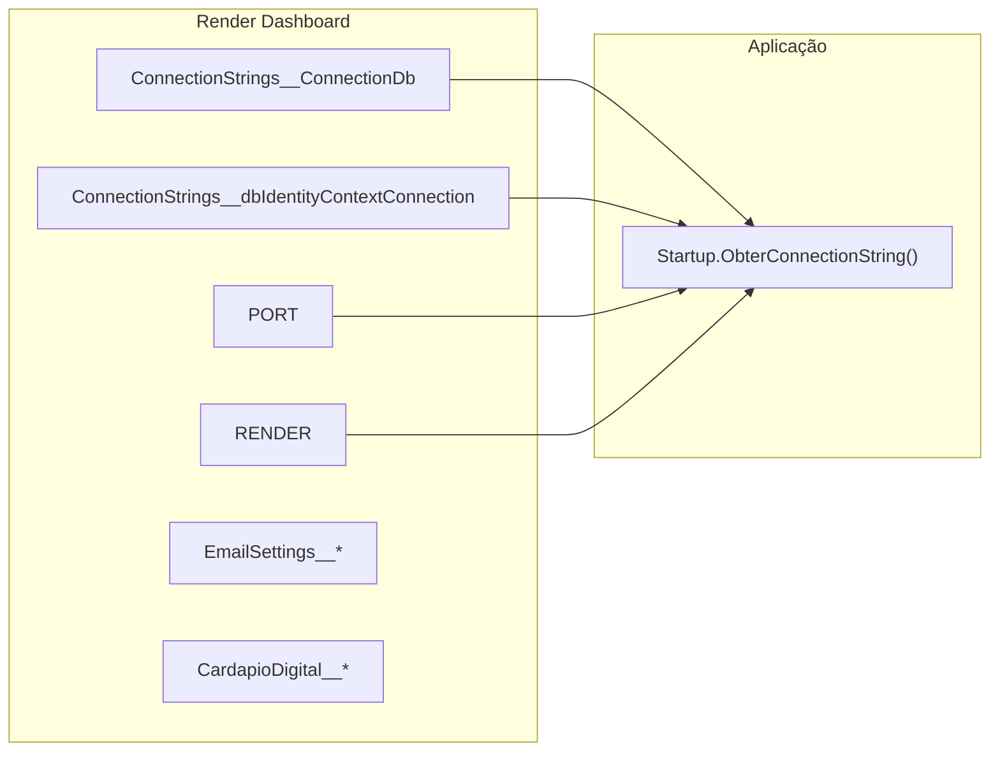
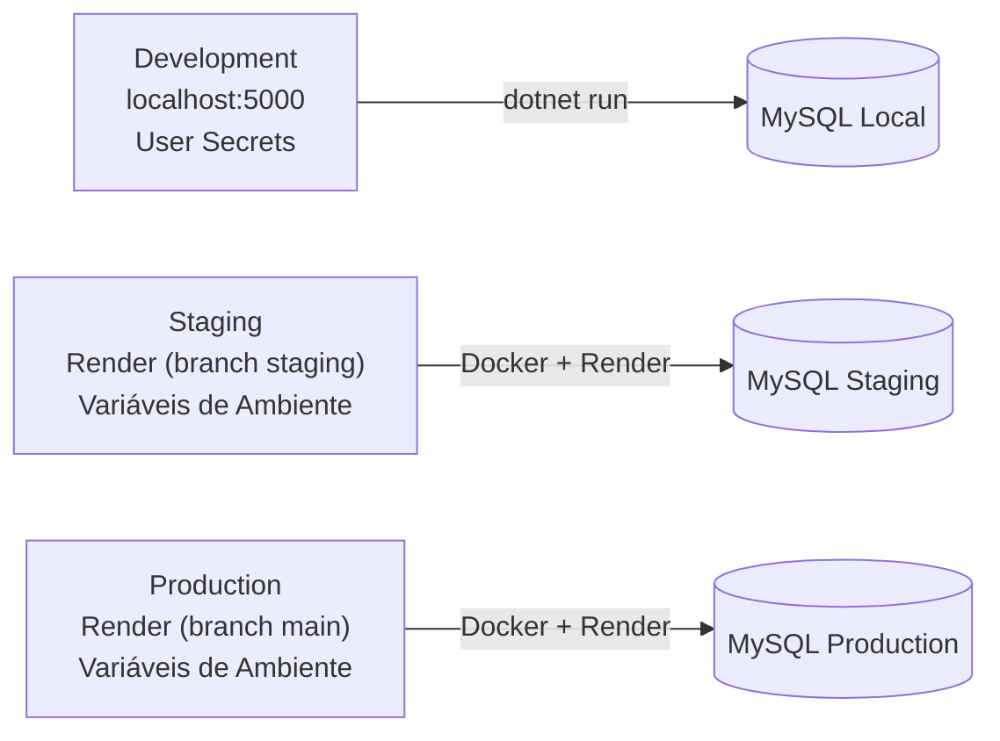

# Diagrama: Deployment

## Objetivo

Representar a arquitetura de deployment do Agilium Manager, incluindo ambientes, contêineres Docker e plataforma cloud (Render).

---

## Arquitetura de Deployment



---

## Docker

### Dockerfile (exemplo MVC)

```dockerfile
FROM mcr.microsoft.com/dotnet/core/aspnet:3.1 AS base
WORKDIR /app
EXPOSE 5000
ENV ASPNETCORE_URLS=http://+:5000

FROM mcr.microsoft.com/dotnet/core/sdk:3.1 AS build
WORKDIR /src
COPY . .
RUN dotnet restore
RUN dotnet publish -c Release -o /app

FROM base AS final
WORKDIR /app
COPY --from=build /app .
ENTRYPOINT ["dotnet", "agilum.mvc.web.dll"]
```

### Projetos com Dockerfile

| Projeto | Dockerfile |
|---------|------------|
| `agilum.mvc.web` | ✅ `Dockerfile` |
| `agilium-manager-azure-api` | ✅ `Dockerfile` |
| `agilium-pdv-azure-api` | ❌ (não localizado) |
| Raiz | ✅ `Dockerfile` |

---

## Configuração para Render

```csharp
// Program.cs
var port = Environment.GetEnvironmentVariable("PORT") ?? "5000";
webBuilder.UseUrls($"http://0.0.0.0:{port}");

// Startup.cs
var isRender = Environment.GetEnvironmentVariable("RENDER") != null;

if (!isRender)
{
    app.UseHttpsRedirection();  // Render gerencia HTTPS no proxy
}
```

---

## Variáveis de Ambiente



---

## Ambientes



---

## Para Preencher

> **TODO:** Adicionar diagrama de CI/CD pipeline e estratégia de backup.
