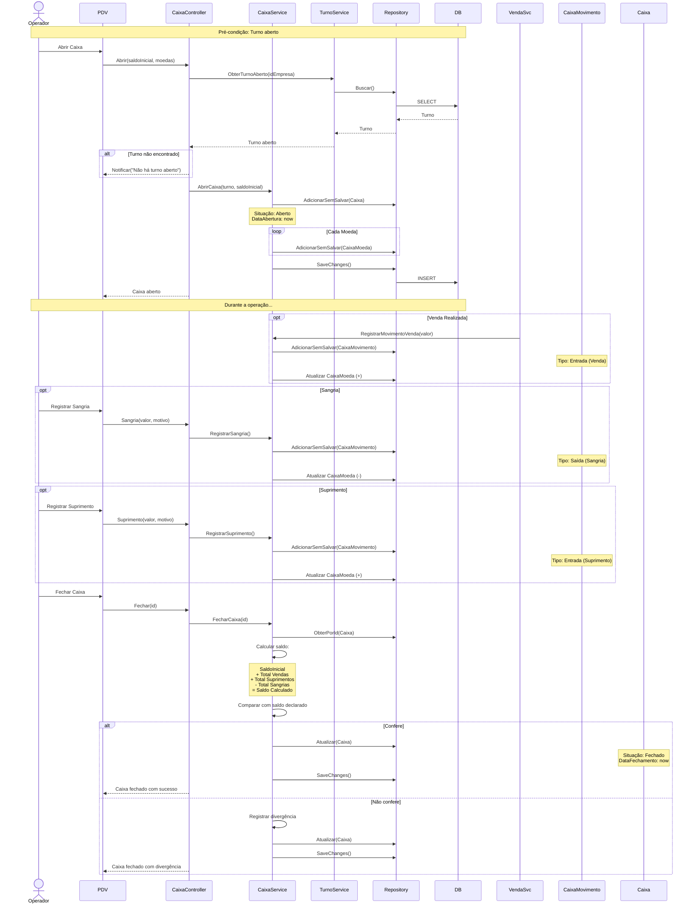
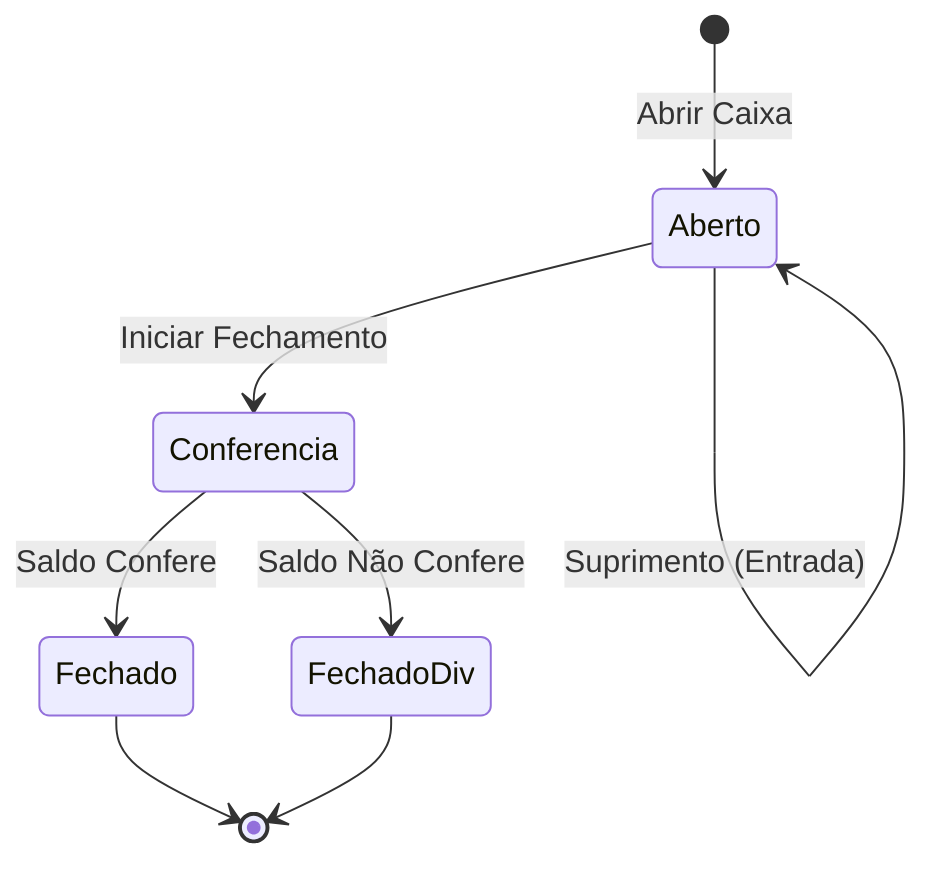

# Diagrama: Fluxo de Caixa

## Objetivo

Representar o fluxo de abertura, operação e fechamento do caixa no PDV do Agilium Manager.

---

## Fluxo Completo

---

## Estados do Caixa

---

## Para Preencher

> **TODO:** Adicionar fluxo de reabertura de caixa e conciliação financeira.
