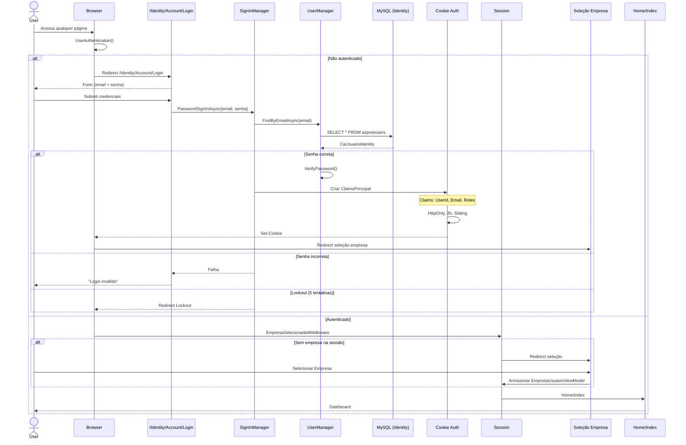
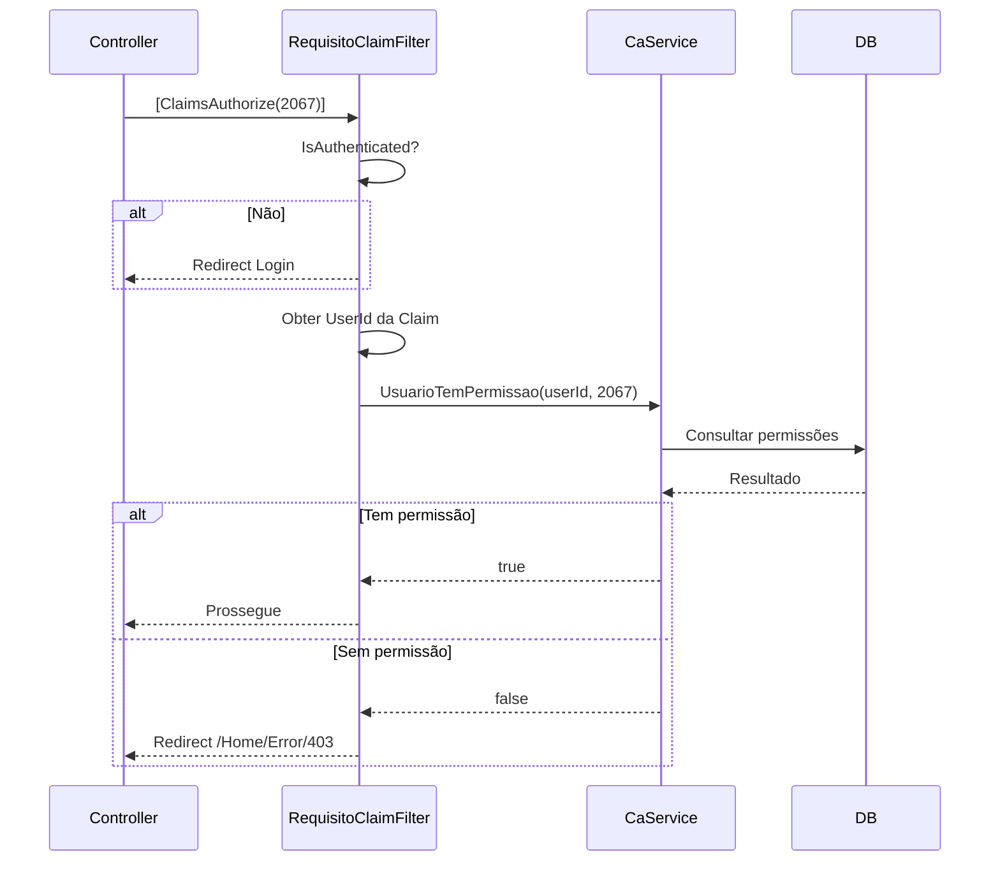

# Diagrama: Fluxo de Login

## Objetivo

Representar o fluxo completo de autenticação do Agilium Manager, incluindo login, validação de credenciais, criação de cookie, seleção de empresa e verificação de permissões.

---

## Fluxo Completo

---

## Verificação de Permissão

---

## Para Preencher

> **TODO:** Adicionar fluxo de refresh token, logout e troca de empresa.
