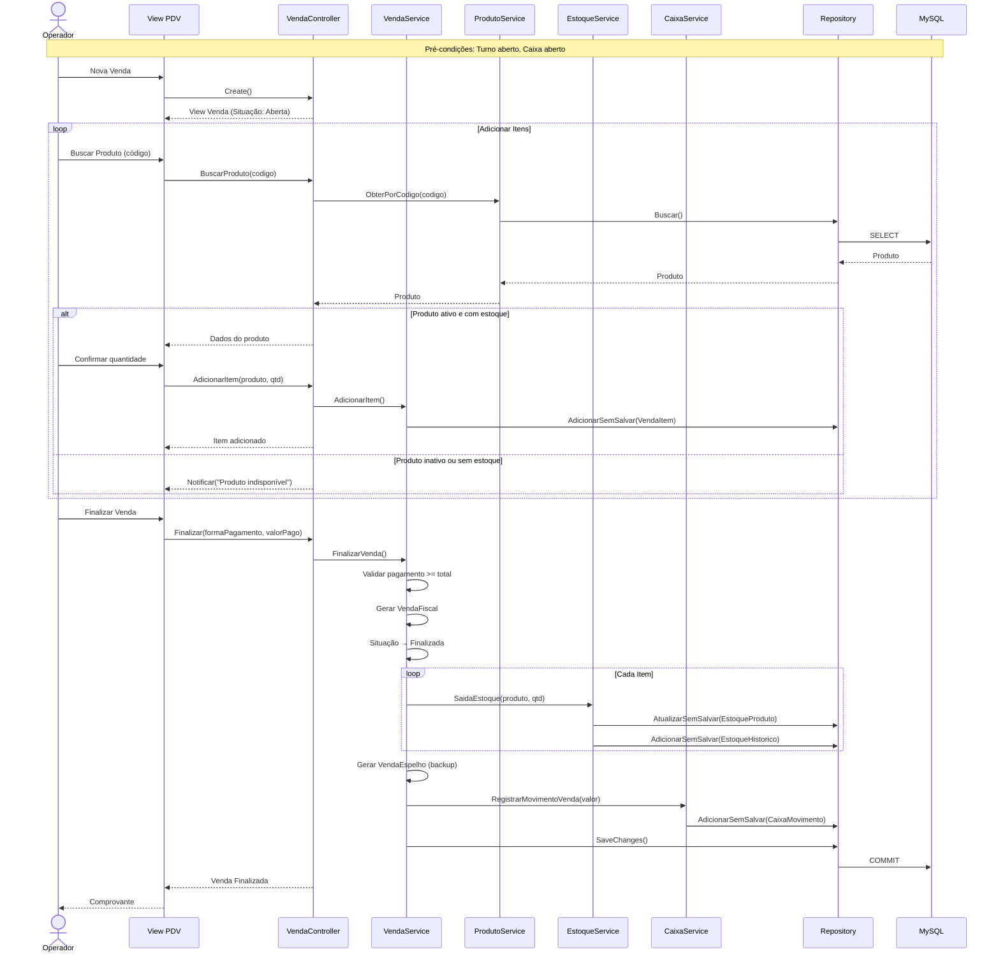
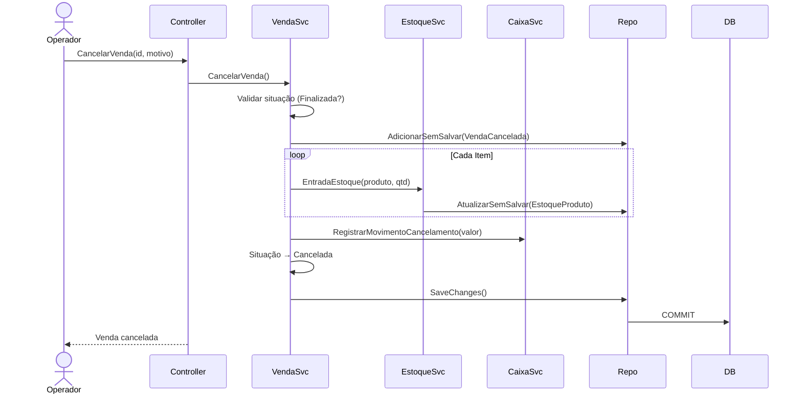

# Diagrama: Fluxo de Venda

## Objetivo

Representar o fluxo completo de uma venda no PDV, desde a abertura até a finalização, incluindo validações, atualização de estoque e integração com caixa.

---

## Fluxo Completo

---

## Cancelamento de Venda

---

## Para Preencher

> **TODO:** Adicionar fluxo de venda temporária (pré-venda) e conversão de pedido em venda.
