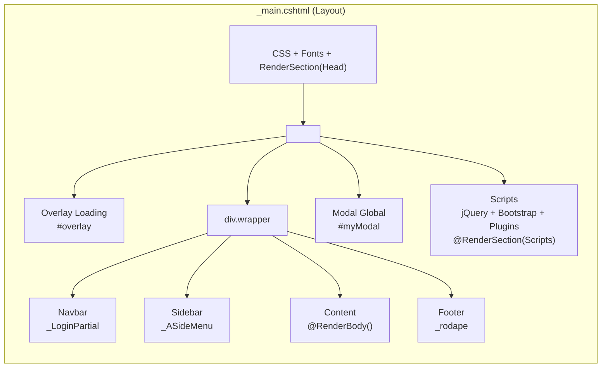
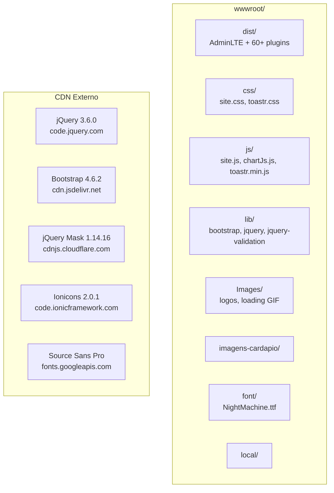
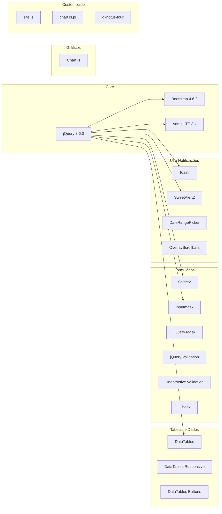

# Diagrama: Frontend

## Objetivo

Representar a arquitetura do frontend do Agilium Manager, incluindo a estrutura de Views, layout AdminLTE, assets estáticos e bibliotecas JavaScript.

---

## Composição da Página

---

## Assets Estáticos

---

## Bibliotecas JavaScript

---

## Para Preencher

> **TODO:** Adicionar wireframes das principais telas (Dashboard, Listagem de Produtos, PDV).
