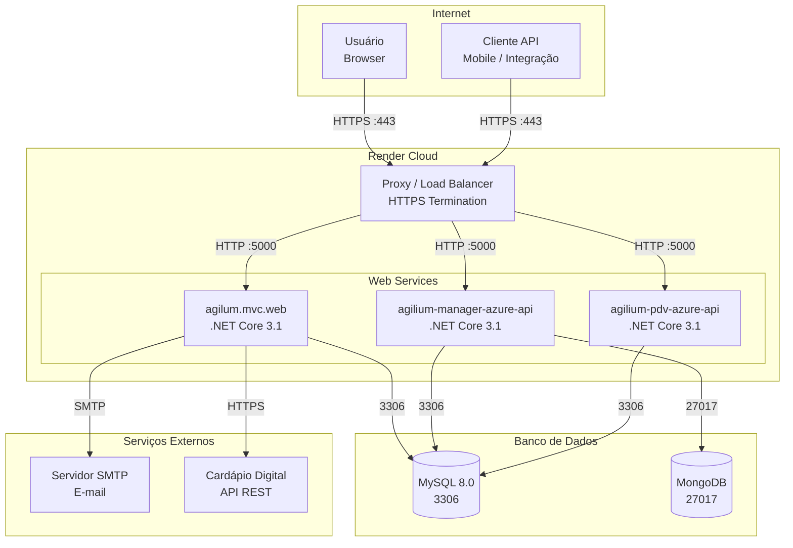
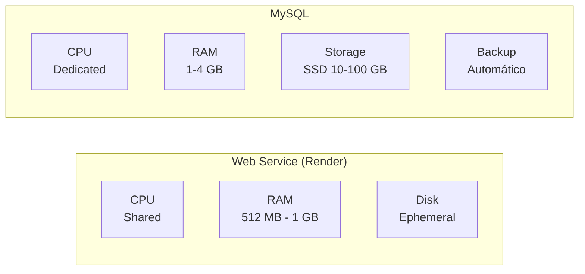
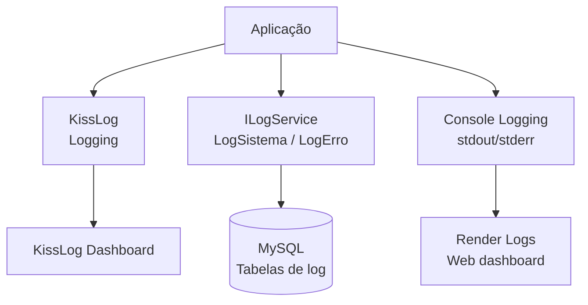

# Diagrama: Infraestrutura

## Objetivo

Representar a infraestrutura de servidores, serviços e rede que suportam o Agilium Manager.

---

## Visão Geral da Infraestrutura

---

## Serviços e Portas

| Serviço | Porta | Protocolo | Origem |
|---------|-------|-----------|--------|
| MVC Web | 5000 | HTTP | Proxy Render |
| API | 5000 | HTTP | Proxy Render |
| PDV API | 5000 | HTTP | Proxy Render |
| MySQL | 3306 | TCP | Web Services |
| MongoDB | 27017 | TCP | API |
| SMTP | 587 | TCP | MVC |
| HTTPS (Proxy) | 443 | HTTPS | Internet |

---

## Recursos Computacionais

---

## Monitoramento e Logs

---

## Para Preencher

> **TODO:** Adicionar diagrama de rede com subnets, firewall e políticas de segurança.
