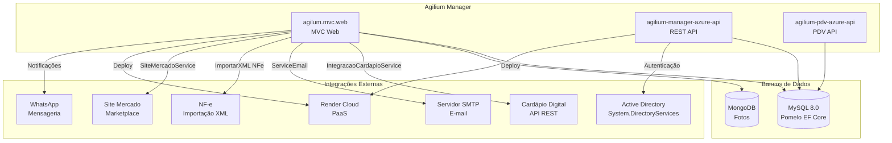
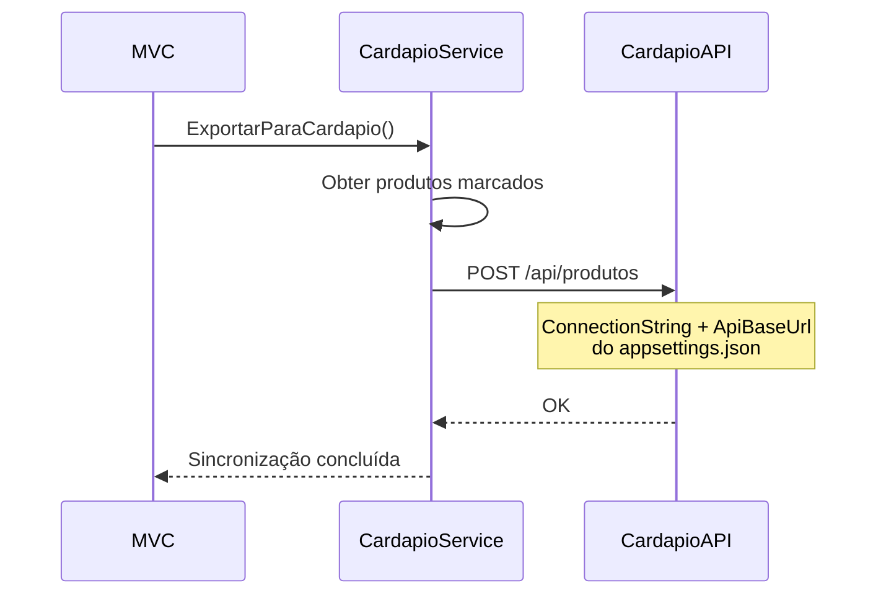
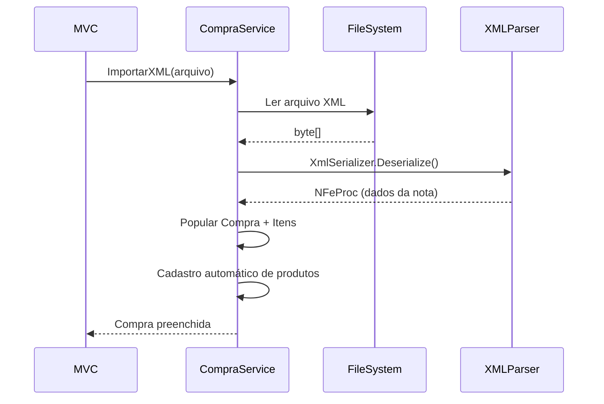
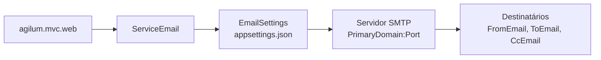

# Diagrama: Integrações

## Objetivo

Representar as integrações externas do Agilium Manager com outros sistemas e serviços.

---

## Mapa de Integrações

---

## Cardápio Digital

## Importação NFe

---

## E-mail

---

## Para Preencher

> **TODO:** Adicionar diagramas de integração com WhatsApp, Active Directory e Marketplace.
