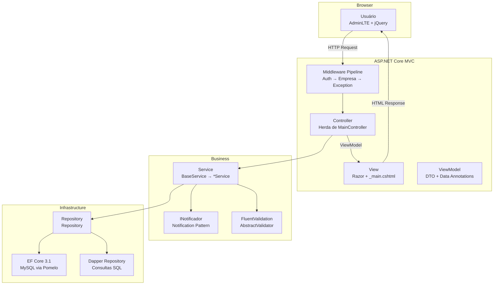
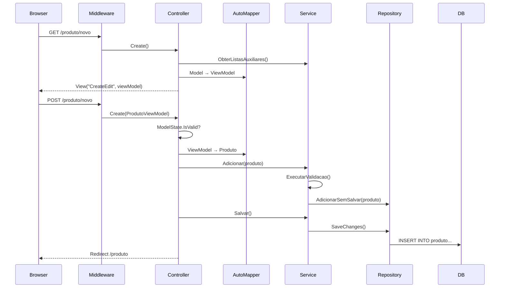

# Diagrama: MVC

## Objetivo

Representar a arquitetura MVC do projeto `agilum.mvc.web`, mostrando a interação entre Controllers, Views, ViewModels e as camadas inferiores.

---

## Diagrama MVC

---

## Fluxo de uma Action

---

## Para Preencher

> **TODO:** Adicionar diagrama detalhado do MainController e seus 8 serviços injetados.
