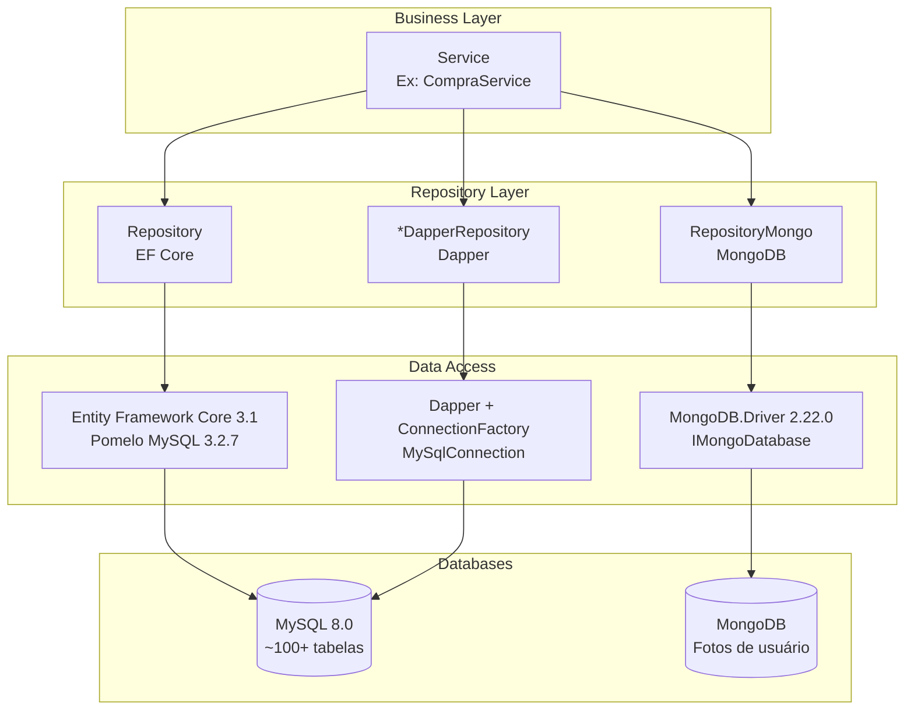
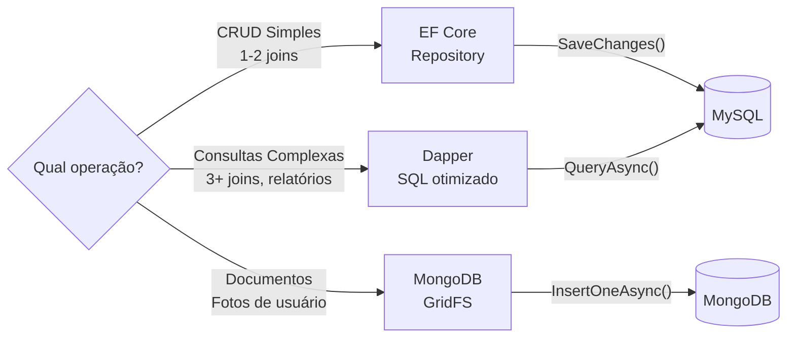
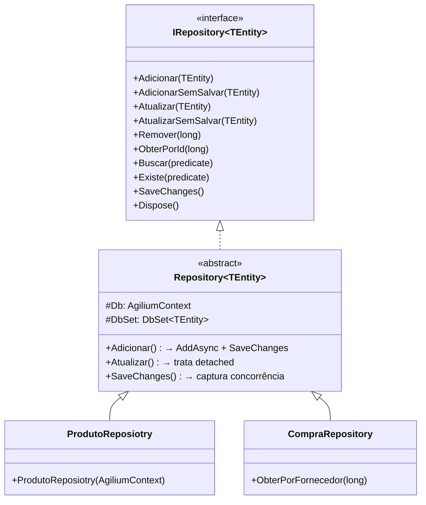

# Diagrama: Persistência

## Objetivo

Representar a arquitetura da camada de persistência do Agilium Manager, mostrando os três mecanismos de acesso a dados: EF Core, Dapper e MongoDB.

---

## Visão Geral



---

## DbContexts

```mermaid
graph TD
    subgraph "DbContexts"
        Agilium["AgiliumContext<br/>agilium-manager-git-azure-infra<br/>~100+ tabelas de negócio"]
        Identity["dbIdentityContext<br/>agilum.mvc.web<br/>Tabelas Identity"]
    end

    subgraph "Tabelas"
        Agilium --> Produto["produto"]
        Agilium --> Compra["compra"]
        Agilium --> Venda["venda"]
        Agilium --> Cliente["cliente"]
        Agilium --> Estoque["estoque"]
        Agilium --> Caixa["caixa"]
        Agilium --> Turno["turno"]
        Agilium --> Conta["conta_pagar / conta_receber"]
        Agilium --> Plano["plano_conta"]
        Agilium --> Fiscal["cfop / cst / ncm / cest"]
        Agilium --> Empresa["empresa"]
        Agilium --> "... 90+ outras tabelas"

        Identity --> Users["aspnetusers"]
        Identity --> Roles["aspnetroles"]
        Identity --> UserRoles["aspnetuserroles"]
        Identity --> Claims["aspnetuserclaims"]
        Identity --> Logins["aspnetuserlogins"]
        Identity --> Tokens["aspnetusertokens"]
    end
```

---

## Estratégia de Acesso



---

## Repository Pattern



---

## Para Preencher

> **TODO:** Adicionar diagrama ER completo com principais entidades e relacionamentos.
