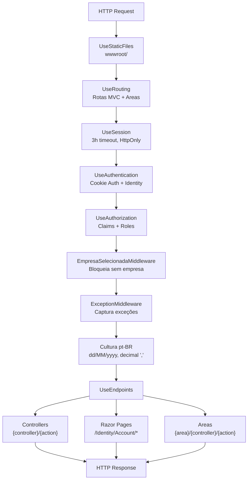
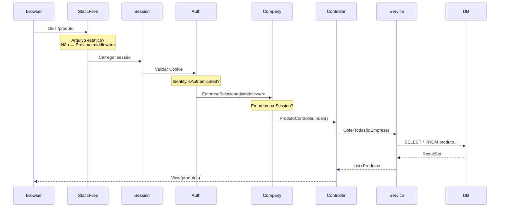
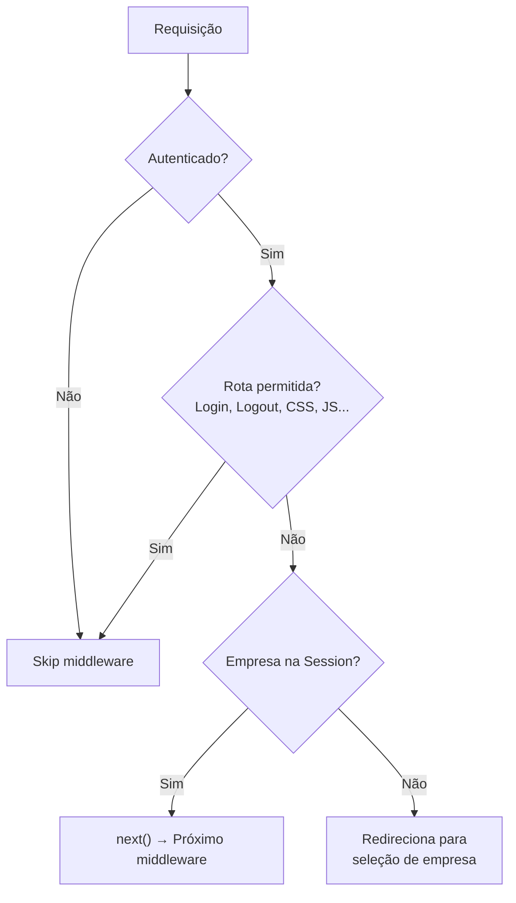
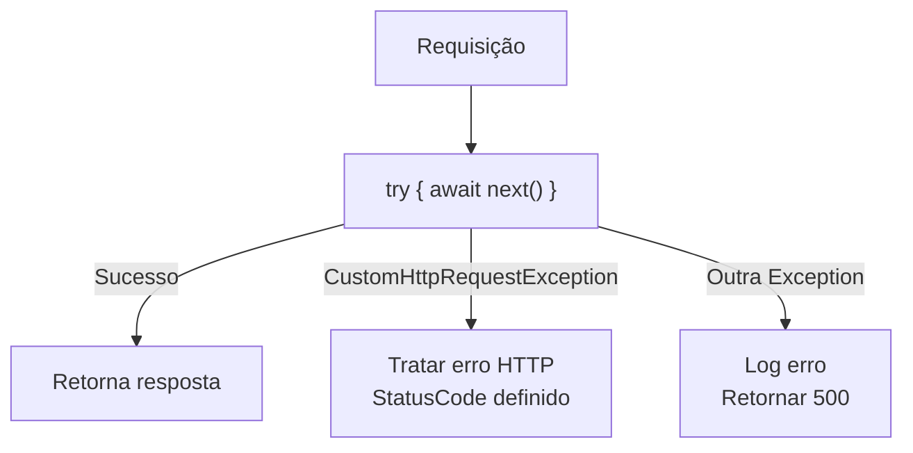

# Diagrama: Request Pipeline

## Objetivo

Representar o pipeline de processamento de requisições HTTP no projeto `agilum.mvc.web`, da entrada até a resposta.

---

## Pipeline Completo

---

## Sequência de Execução

---

## Middlewares Customizados

### EmpresaSelecionadaMiddleware

### ExceptionMiddleware

---

## Para Preencher

> **TODO:** Adicionar diagrama de sequência detalhado com tempos de cada middleware.
