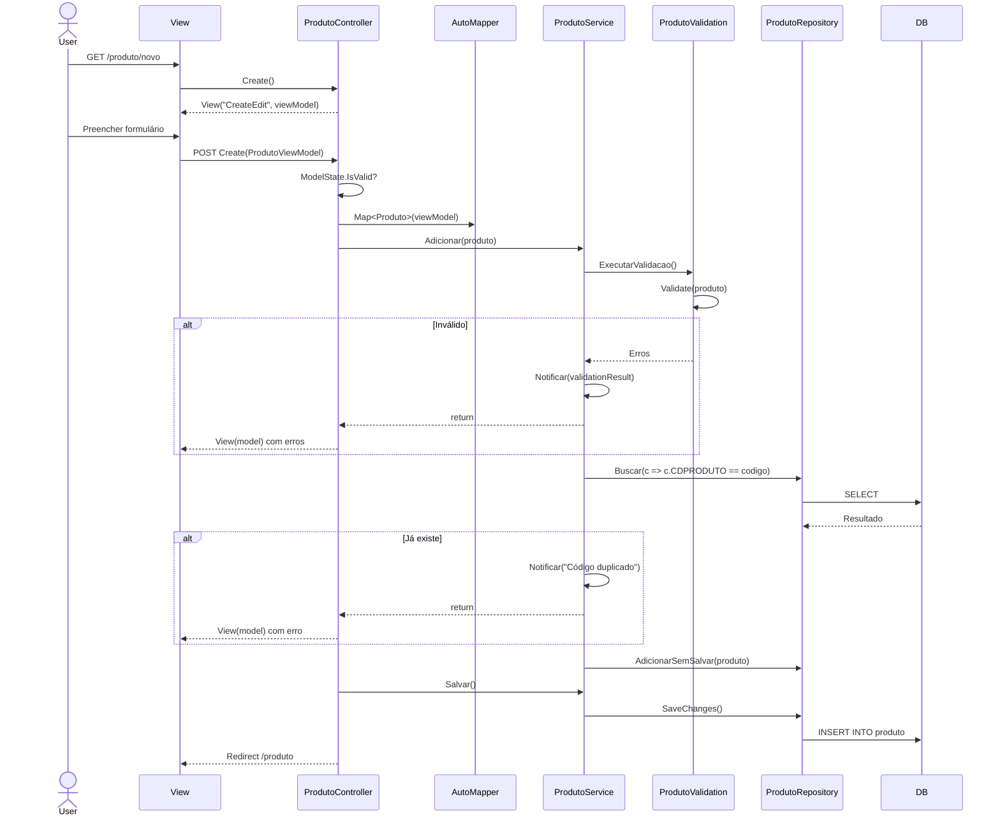
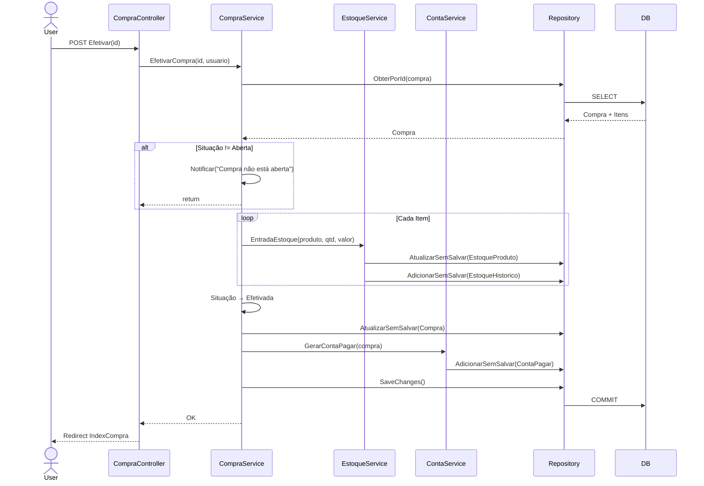
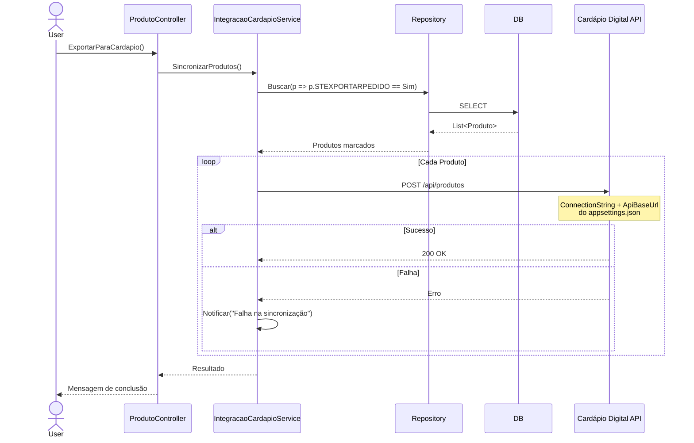

# Diagramas de Sequência

## Objetivo

Agrupar diagramas de sequência para os principais fluxos do Agilium Manager, complementando os diagramas específicos de venda, login e caixa.

---

## Fluxo: Criar Produto

---

## Fluxo: Efetivar Compra

---

## Fluxo: Sincronizar Cardápio Digital

---

## Para Preencher

> **TODO:** Adicionar diagramas de sequência para: inventário, devolução, fechamento de turno, conciliação financeira.
