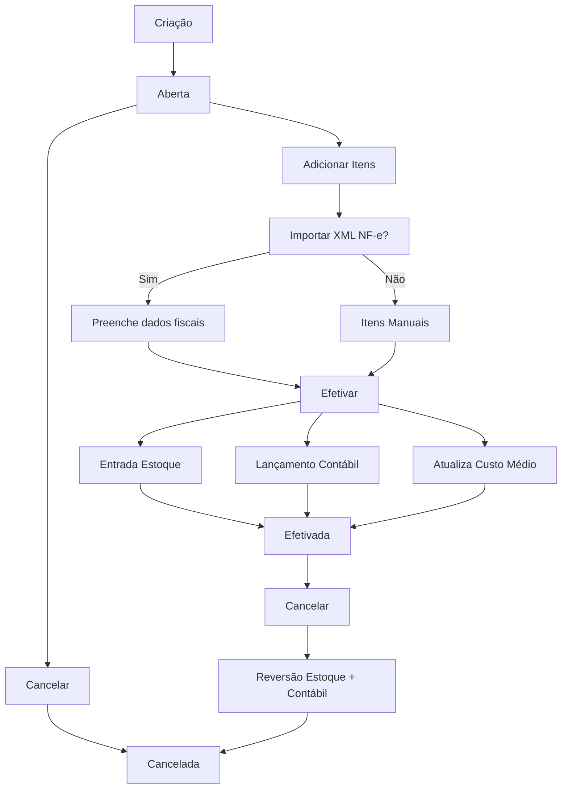

# Compra

## Objetivo

Documentar o fluxo de compras: criação, importação XML NF-e, cadastro automático de produtos, efetivação (estoque + contábil) e cancelamento.

---

## Visão Geral

Compras seguem o ciclo **Aberta → Efetivada** (ou **Cancelada**). A principal fonte de dados é a importação de XML de NF-e. A efetivação é atômica: atualiza estoque, custo médio, preço de venda e gera lançamentos contábeis.

---

## Fluxo Principal

```
Criação: CompraService.Adicionar(compra)
      │  STCOMPRA = Aberta (1)
      │  CDCOMPRA gerado automaticamente
      ▼
Adicionar Itens (CompraItem)
      │  IDPRODUTO, NUQTD, VLUNIT, dados fiscais
      ▼
[Opcional] Importar XML NF-e
      │  CompraService.ImportarCompraDeXmlNfe(nfe, id)
      │  Preenche NUNF, chave, dados fiscais
      │  Cria CompraFiscal (armazena XML)
      ▼
[Opcional] Cadastro Automático de Produto
      │  CompraService.RealizarCadastroProdutoAutomatico(id)
      │  Só p/ itens sem IDPRODUTO
      ▼
Efetivar: CompraService.EfetivarCompra(idCompra, usuario)
      │  BEGIN TRANSACTION
      ├── P/ cada item:
      │     ├── qtd = NUQTD × NURELACAO
      │     ├── vlVenda = VLUNIT ÷ NURELACAO
      │     ├── AtualizarCustoMedio()
      │     ├── AtualizarUltimoValorCompra()
      │     ├── Se VLNOVOPRECOVENDA > 0 → AtualizarPrecoVenda()
      │     ├── RealizaEntrada() → EstoqueHistorico
      │     ├── InsereProdutoCodigoBarra() (se EAN novo)
      │     └── RealizarLancamento() → PlanoContaLancamento (Débito)
      ├── AtualizarSaldoContaESubConta()
      ├── STCOMPRA = Efetivada (2)
      └── COMMIT
```

---

## Cancelamento

```
CompraService.CancelarCompra(idCompra, usuario)
      │
      ├── Se Aberta (1): apenas muda status → Cancelada (3)
      │
      └── Se Efetivada (2):
            ├── Desvincula lançamentos contábeis
            ├── Exclui lançamentos
            ├── RealizaRetirada() → EstoqueHistorico negativo
            ├── Atualiza saldo contábil
            └── STCOMPRA = Cancelada (3)
```

---

## Regras de Negócio

Consultar:

`docs/business-rules/`

---

## Módulos Envolvidos

- `knowledge/business/compras.md`
- `knowledge/business/estoque.md`
- `knowledge/business/fornecedores.md`
- `knowledge/business/fiscal.md`

---

## APIs Relacionadas

- `agilum.mvc.web/Controllers/CompraController.cs` — `/compra/novo`, `/compra/importar`, `/compra/efetivar`, `/compra/cancelar`
- `agilium-manager-azure-api/V1/CompraController.cs`

---

## Banco de Dados

- `compra` — CDCOMPRA, STCOMPRA, IDFORN, dados fiscais da NF
- `compra_item` — IDPRODUTO, NUQTD, VLUNIT, NURELACAO, dados fiscais
- `compra_fiscal` — XML da NF-e

---

## Diagramas



---

## ADRs Relacionadas

Consultar:

`knowledge/decisions.md`

---

## Documentação Relacionada

- `docs/fluxos/fluxo-compra.md` — Documentação oficial detalhada
- `docs/fluxos/fluxo-estoque.md` — Entrada por compra

---

## Documentação Oficial

`docs/fluxos/fluxo-compra.md`

---

## Fluxo Recomendado para Agentes de IA

1. Verificar `CompraService.EfetivarCompra()` — lógica completa
2. Verificar `CompraService.ImportarCompraDeXmlNfe()` — importação NF-e
3. Verificar `CompraService.CancelarCompra()` — reversão
4. Verificar `docs/fluxos/fluxo-compra.md` para fluxo detalhado

---

## Resumo

Ciclo Aberta → Efetivada/Cancelada. Importação XML NF-e como principal entrada. Efetivação atômica: estoque + custo médio + preço venda + contábil. Cancelamento reverte tudo.
