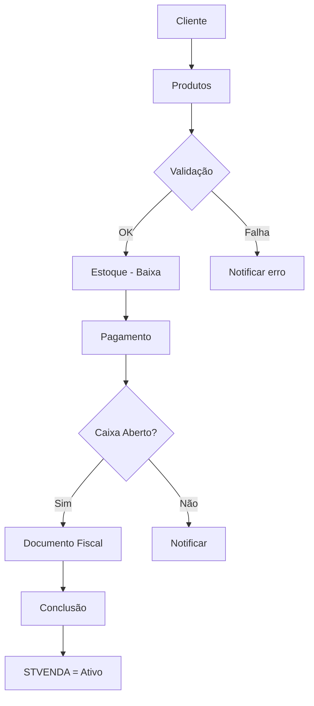

# Venda

## Objetivo

Documentar o fluxo de venda — o mais importante do sistema: realização, pré-venda (VendaTemporaria), cálculo de IBPT, cancelamento e integração com Caixa, Estoque e Fiscal.

---

## Visão Geral

A venda é realizada via `VendaService.RealizarVenda()` em uma transação atômica. Depende de caixa aberto. Suporta pré-venda e cancelamento com reversão. Calcula IBPT para exibição na NFC-e. Estados: `STVENDA = Ativo (1)` ou `Inativo (0)`.

---

## Fluxo Principal

```
Cliente (opcional)
      ↓
Produtos (VendaItem[])
      ↓
Validação (VendaValidation)
      ↓
Estoque (baixa)
      ↓
Pagamento (VendaMoeda[])
      ↓
Caixa (deve estar Aberto)
      ↓
Documento Fiscal (NFC-e / IBPT)
      ↓
Conclusão (STVENDA = Ativo)
```

### RealizarVenda (detalhado)

```
VendaService.RealizarVenda(venda, idUsuario, idEmpresa)
      │
      ├── Validar: VendaItem.Any() && VendaMoeda.Any()
      ├── Validar: VLVENDA > 0, VLTOTAL > 0
      ├── Validar itens (VLITEM, NUQTD) e moedas (VLPAGO)
      │
      ├── Obter funcionário: ObterIdFuncionarioPorUsuarioEmpresa()
      ├── Obter caixa aberto: ObterCaixaAberto(idEmpresa, idFuncionario)
      ├── Obter estoque do caixa: ObterEstoquePorIdCaixa()
      │
      ├── BEGIN TRANSACTION
      │
      ├── Gerar SQVENDA (sequencial)
      ├── Obter CPF/CNPJ do cliente
      │
      ├── Config VENDAS_DOC_FISCAL_PADRAO (NFCE padrão)
      │
      ├── venda.MudarSituacaoAtivo()  → STVENDA = Ativo (1)
      ├── venda.AdicionarOrigemVenda(DIRETA)
      ├── venda.AdicionarIbpt(...)     → tributos aproximados
      │
      ├── Criar VendaTemporaria
      ├── Se NÃO pré-venda: criar Venda definitiva + apagar temporária
      │
      ├── UtilizarValePorVenda() (se houver vales)
      │
      └── COMMIT
```

---

## Cancelamento

```
VendaCancelada:
      ├── IDVENDA, Motivo, UsuarioCancelamento
      ├── Reverte itens ao estoque (entrada)
      ├── ETipoEmissaoVenda → Cancelada (3)
      └── STVENDA pode ser mantido Ativo ou alterado
```

---

## Pré-Venda (VendaTemporaria)

```
Config: PDV_PREVENDA ("S" = MEI sem cupom)
        PREVENDA_ATIVO ("S" = pré-venda ativa)

VendaTemporaria → VendaTemporariaItem, VendaTemporariaMoeda
      │
      └── Converter para Venda definitiva posteriormente
```

---

## Regras de Negócio

- Caixa deve estar Aberto (`ESituacaoCaixa.Aberto = 1`)
- `STVENDA` é `Ativo (1)` para venda vigente, `Inativo (0)` para cancelada
- Tipo de documento fiscal padrão: **NFC-e**
- IBPT calculado para exibição na NFC-e
- Vales consumidos automaticamente

---

## Módulos Envolvidos

- `knowledge/business/vendas.md`
- `knowledge/business/caixa.md`
- `knowledge/business/estoque.md`
- `knowledge/business/fiscal.md`
- `knowledge/business/pagamentos.md`

---

## APIs Relacionadas

- `IVendaService` — `RealizarVenda()`
- `IVendaDapperRepository` — `AdicionarVenda()`, `AdicionarVendaTemporaria()`
- `ICaixaDapperRepository` — `ObterCaixaAberto()`
- `agilum.mvc.web/Controllers/VendaController.cs`

---

## Banco de Dados

- `venda` — STVENDA, VLVENDA, VLTOTAL, STVENDA
- `venda_item` — IDPRODUTO, NUQTD, VLITEM
- `venda_moeda` — IDMOEDA, VLPAGO
- `venda_fiscal` — Dados fiscais
- `venda_cancelada` — Cancelamentos
- `venda_espelho` — Cópia de segurança
- `venda_temporaria` — Pré-venda

---

## Diagramas



---

## ADRs Relacionadas

Consultar:

`knowledge/decisions.md`

---

## Documentação Relacionada

- `docs/fluxos/fluxo-venda.md` — Documentação oficial detalhada
- `docs/fluxos/fluxo-caixa.md` — Caixa como pré-condição
- `docs/fluxos/fluxo-estoque.md` — Baixa de estoque

---

## Documentação Oficial

`docs/fluxos/fluxo-venda.md`

---

## Fluxo Recomendado para Agentes de IA

1. Verificar `VendaService.RealizarVenda()` — fluxo completo
2. Verificar `Venda` model com `ESituacaoVenda` (Ativo=1, Inativo=0)
3. Verificar `ICaixaDapperRepository.ObterCaixaAberto()` — pré-condição
4. Verificar `IValeDapperRepository.UtilizarValePorVenda()`
5. Consultar `docs/fluxos/fluxo-venda.md` para detalhes

---

## Resumo

Venda é o fluxo central. Atômica, depende de caixa aberto. Suporta pré-venda e cancelamento. Calcula IBPT para NFC-e. Integra com Estoque, Caixa, Fiscal e Pagamentos.
